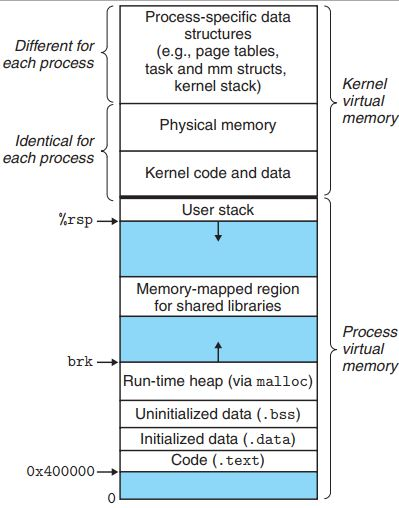

# Виртуальное адресное пространство процесса

Процессы в операционной системе изолируются друг от друга. В частности, каждый из них имеет своё изолированное виртуальное адресное пространство. Оно разбито на маленькие блоки, называемые страницами. Физически страница может находиться не только в памяти, но и на диске. Это позволяет исполнять программы, которым нужно больше памяти, чем есть в компьютере. Кроме того, одну и ту же физическую страницу можно использовать в нескольких процессах (например ту, в которую загружен фрагмент стандартной библиотеки). Трансляцией виртуальных адресов в физические занимается процессор, а конкретно Memory Management Unit в нём.

## Секции памяти



В рамках виртуального адресного пространства память разделена на несколько секций.

* `.text` хранит код программы
* `.data` хранит глобальные инииализрованные переменные
* `.bss` хранит неинициализированные глобальные переменные.

Посмотреть на содежимое этих секций можно с помощью флага `-t` команды `objdump`. Предлагается погрепать её вывод на примере `sections.c`.

С кучей и стеком вы уже знакомы из прошлых курсов. Важно про них запомнить, что стек растёт вниз, а куча наверх (по адресам). При этом через `objdump` вы не увидите переменные созданные на стеке и куче, потому что память под них выделяется динамически.

> Адреса внутри массива всё ещё растут вверх. Почему? (`a[i] = *(a + i)`)


## mmap

```
#include <sys/mman.h>

void *mmap(
    void *addr,    /* рекомендуемый адрес отображения */
    size_t length, /* размер отображения, дополняется до кратного размеру страницы */
    int prot,      /* аттрибуты доступа PROT_READ/PROT_WRITE/PROT_EXE/PROT_NONE */
    int flags,     /* флаги совместного отображения  MAP_PRIVATE/MAP_SHARED/MAP_FIXED/MAP_ANONYMOUS */
    int fd,        /* файловый декскриптор фала */
    off_t offset   /* смещение относительно начала файла, должен быть кратен размеру страницы */
  );

int munmap(void *addr, size_t length) /* освободить отображение */
```

Системный вызов `mmap` предназначен для создания в виртуальном адресном пространстве процесса доступной области по определенному адресу. Эта область может быть связана как с открытым файлом, так и только с участком в оперативной памяти (флаг `MAP_ANONYMOUS`). Память выделяется постранично.

Атрибуты доступа аналогичны файловым. Флаг `MAP_SHARED` позволяет делать память доступной другим процессам, `MAP_PRIVATE` наоборот (в случае файла, изменения в него не сохраняются).

## /proc

`proc` это виртуальная файловая система, которая позволяет просматривать структуры ядра. Про все её применения можно почитать, например, в [man'е](https://man7.org/linux/man-pages/man5/proc.5.html). Мы здесь поговорим только о том, как можно с её помощью залезть в память процесса.

Чтобы получить доступ к маппингам, можно воспользоваться командой 
`cat /proc/pid/maps`.

Вывод получится примерно следующего вида:

`7f6d4e51e000-7f6d4e51f000 r--p 00000000 08:09 948631                     /home/arslan/teaching/caos-seminars/sem10-mmap/small_file.txt`

Где

* `7f6d4e51e000-7f6d4e51f000` это диапазон адресов в виртуально памяти процесса
* `r--p` это флаги доступа
* `00000000` это отступ от начала файла
* `08:09` id устройства
* `948631` inode файла
* `/home/arslan/teaching/caos-seminars/sem10-mmap/small_file.txt` путь к файлу

Через `/proc/pid/mem` можно получить доступ к памяти процесса. Для этого нужно сначала подцепиться к процессу через `ptrace(PTRACE_ATTACH, pid, NULL, NULL)` (чтобы сработало, нужно либо дать конкретному исполняемому файлу разрешение на ptrace `sudo setcap cap_sys_ptrace+eip proc_mem_demo.out`, либо запустить его под sudo). Так делают, например, дебаггеры. После этого можно открыть `/proc/pid/mem` просто как файл на чтение, сдвинуться с помощью `lseek` на смещение, равное адресу в виртуальной памяти процесса и что-нибудь прочитать. `proc_mem_demo.c`, например, считывает первые несколько байт заmmap'ленного в память файла.

## Page faults

Page fault это аппаратное исключение, возникающее при обращении к странице памяти, которая не загружена в адресное пространство процесса. Они бывают трёх видов:

* __minor__ -- если страница есть в оперативной памяти, но не в отмечена как загруженная в виртуальном адресном пространстве процесса. Обычно это означает, что кто-то из других процессов её уже загрузил.
* __major__ -- если страницы нет в оперативной памяти. Это значит, что нужно выделить место в памяти и загрузить туда страницу с диска.
* __invalid__ -- если обращение идёт по адресу не из адрессного пространство процесса. Обычно приводит к Segmenation fault.

Считать количество page fault можно с помощью системного вызова `getrusage`.

Будем проводить следующий эксперимент. Возьмём файл `big_file.txt`, представлющий собой строку цифр, предваритально сгенерированный скриптом `gen_big_file.py`. Будем считать количество вхождений каждой цифры в него с помощью `mmap` (см. `mmap_demo.c`).

Перед каждым запуском эксперимента будем чистить кэш страниц с помощью команды

`sudo sh -c 'echo 1 >/proc/sys/vm/drop_caches'` 

Запустим программу в первый раз `./mmap_demo.out big_file.txt`. Сколько вы ожидаете увидеть `Major page fault`. Почему?

На самом деле, получилось `Major page faults: 1`. Почему?

Доступ к диску довольно трудозатратная операция. Поэтому, когда вы вычитываете заmmapленные данные, операционная система пытается предугадать ваши действия и считывает несколько следующих блоков.

Запустим программу ещё раз, увидим с большой вероятностью `Major page faults: 0`, потому что страницы с содержимым файла ещё не успело вытеснить из кэша.

Почистим кэш и раскомментируем 17 строку. В ней мы говорим операционной системе, что к данному участку памяти собираемся обращаться случайным образом, поэтому смысла вычитывать несколько следующих блоков нет. Почистим кэши и перезапустим программу (не забыв её перекомпилировать). Увидим, что количество page fault примерно стало равно `file_size_in_bytes/4096`, что мы означально и ожидали.

## Бонус: Процессорные кэши

В процессорах, как правило, есть 3 уровня кэшей, которые быстрее оперативной памяти. Как их использование на производительность, можно посмотреть в [репозитории](https://github.com/emilk/ram_bench).
