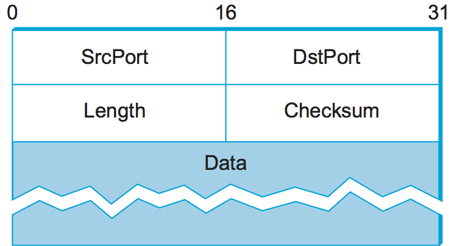
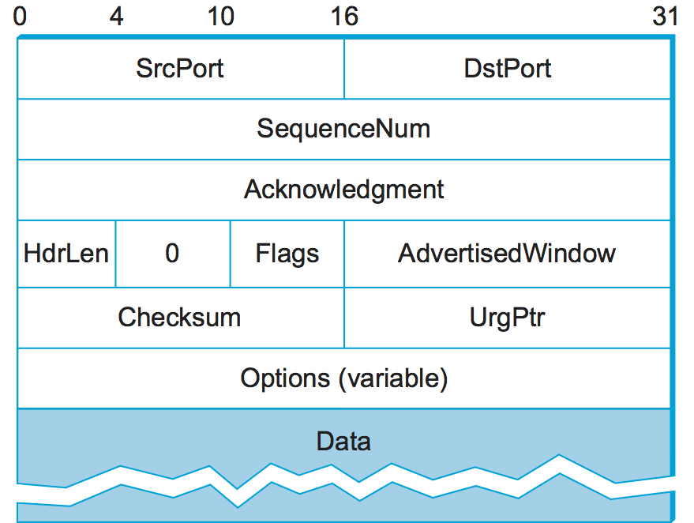
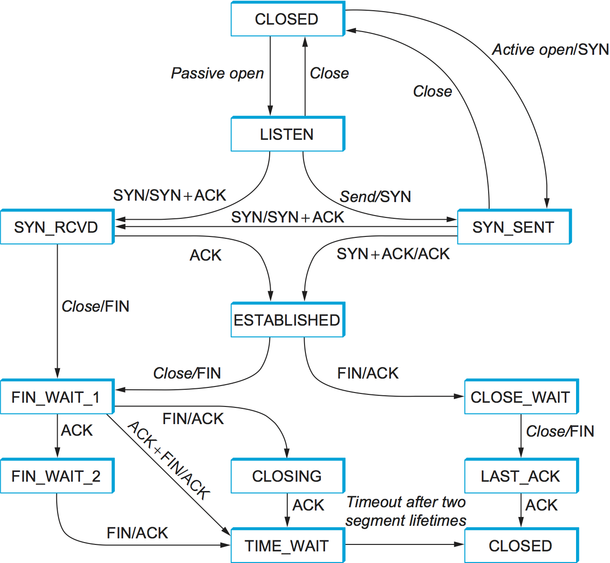
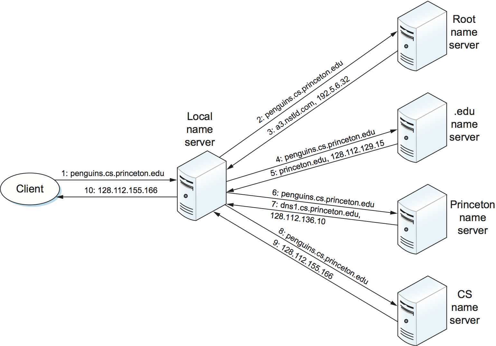

# Сокетное программирование

Сокеты -- ещё один инструмент межпроцессорного взаимодействия. Как и пайпы, они работают через интерфейс файловых дескрипторов. Но нет разделения на читающий и пишущий концы, а сами процессы могут быть запущены на разных компьютерах.

Создаётся сокет с помощью системного вызова `socket`:

```
#include <sys/types.h>
#include <sys/socket.h>

int socket(
  int domain,    // AF_UNIX (local)|| AF_INET (ipv4) || AF_INET6 (ipv6) || AF_PACKET (low-level)
  int type,      // SOCK_STREAM (tcp) || SOCK_DGRAM (udp)
  int protocol   // номер протокола или 0 для авто-выбора
)
```

Далее в примерах мы в основном будем использовать IPv4 адресацию и TCP в качестве транспорта.

При взаимодействии через сокеты один процесс, называемый сервером, слушает пакеты на определённом адресе и порте, а другой, называемый клиентом, к нему подключается.

## UDP



UDP простой транспортный протокол. Он не устанавливает соединение, а просто посылает отдельные датаграммы. Применяется в случаях, когда небольшие потери пакетов не так критичны, как скорость. Например, в стриминге.

Чтобы отправлять и получать данные из сокета, можно использовать системные вызовы `sendto` и `recvfrom`. Они отличаются от `read` и `write` тем, что принимают в конце флаги и адрес.

```
ssize_t sendto(
    int sockfd,                       // socket
    const void *buf,                  // data
    size_t len,                       // data length
    int flags,                        // usually unused
    const struct sockaddr *dest_addr, // address
    socklen_t addrlen                 // address length
);

ssize_t recvfrom(
    int sockfd,                       // socket
    const void *buf,                  // data
    size_t len,                       // data length
    int flags,                        // usually unused
    const struct sockaddr *dest_addr, // address
    socklen_t addrlen                 // address length
);              
```

Первое поле в `sockaddr` это всегда тип адреса. А дальше для разных типов набор полей может отличаться, поэтому нужно явно передавать размер структуры. Пример структуры для IPv4:

```
#include <sys/socket.h>
#include <netinet/in.h>

struct sockaddr_in {
  sa_family_t    sin_family; // AF_INET
  in_port_t      sin_port;   // uint16_t port
  struct in_addr sin_addr;   // address
};

struct in_addr {
    uint32_t s_addr; // ip address
};
```

Важно, что и порт, и IP записываются в Big Endian. 

Конвертировать их в Little Endian можно с помощью функций `<arpa/inet.h>`:
 * `uint32_t htonl(uint32_t hostlong)` - 32-битное из системного в сетевой порядок байт;
 * `uint32_t ntohl(uint32_t netlong)` - 32-битное из сетевого в системный порядок байт;
 * `uint16_t htons(uint16_t hostshort)` - 16-битное из системного в сетевой порядок байт;
 * `uint16_t ntohs(uint16_t netshort)` - 16-битное из сетевого в системный порядок байт.

Пример клиента можно посмотреть в `udp_client.c`.

Чтобы запустить сервер и начать обслуживать клиентов, нужно закрепиться за некоторым портом с помощью системного вызова `bind`.

```
int bind(
  int sockfd,                  // socket fd
  const struct sockaddr *addr, // server address
  socklen_t addrlen            // server address length
)
```

Сервер будет слушать подключения только в той сети, адрес который вы передадите в `bind`. Частая ошибка -- слушать по адресу `127.0.0.1`. Это зарезервированный адрес для сети, состоящей только из вашего компьютера. То есть другие машины не смогут к вам подключиться. Если передать адрес, `0.0.0.0`, сервер будет ожидать подключения на всех сетевых интерфейсах.

> Можно это продемонстрировать с помощью `nc`.

Пример сервера можно посмотреть в `udp_server.c`.

## TCP



TCP это надёжный транспортный протокол, который подтверждает доставку и сохраняет порядок пакетов. В отличии от UDP, он не посылает отдельные пакеты, а создаёт соединение между узлами.

### Клиент

Клиент подключается к серверу с помощью системного вызова `connect`. 

```
int connect(
  int sockfd,                  // socket fd
  const struct sockaddr *addr, // server address
  socklen_t addrlen            // server address length
)
```

После использования соединения нужно его завершить с помощью системного вызова `shutdown`.

```
int shutdown(
    int sockfd, // socket fd
    int how // SHUT_RD || SHUT_RDWR
)
```

Пример клиента можно посмотреть в `tcp_client.c`.

### Сервер

Чтобы запустить сервер, нужно закрепиться за некоторым портом с помощью системного вызова `bind`.

```
int bind(
  int sockfd,                  // socket fd
  const struct sockaddr *addr, // server address
  socklen_t addrlen            // server address length
)
```

После этого нужно запустить ожидание клиентов на сокете с помощью системного вызова `listen`.

```
int listen(
    int sockfd,                // socket fd
    int backlog                // wait queue size, usually SO_MAXCONN
)
```

Начать обслуживать очерередного клиента из очереди можно с помощью системного вызова `accept`, который при успехе возвращает файловый дескриптор.

```
int accept(
  int sockfd,                  // socket fd
  struct sockaddr *addr,       // client address, can be NULL
  socklen_t *addrlen           // client address length, can be NULL
)
```

Пример сервера можно увидеть в `tcp_server.c`.



### Обслуживание нескольких клиентов

Чем плоха текущая реализация? Она обслуживает одновременно только одного клиента. Чтобы это исправить, можно, например создавать новый процесс под обслуживание каждого клиента (так делает популярный веб-сервер Apache). Пример можно посмотреть в `tcp_server_fork.c`.

Как можно сделать эффективнее? Заводить вместо процессов потоки. Но всё ещё получится не слишком эффективно, потому что потоки постоянно будут надолго блокироваться на чтении/записи. Чтобы обойти эту проблему, нам понадобится механизм асинхронного ввода/вывода и epoll, но об этом на следующем семинаре.

## DNS



Для получения структуры `addrinfo` по домену предназначена функция `getaddrinfo`.

```
int getaddrinfo(
    const char *node, // host
    const char *service, // port
    const struct addrinfo *hints, // get results with given params: family/socktype/protocol
    struct addrinfo **res // pointer to array for result
);

struct addrinfo {
    int              ai_flags;
    int              ai_family;
    int              ai_socktype;
    int              ai_protocol;
    socklen_t        ai_addrlen;
    struct sockaddr *ai_addr;
    char            *ai_canonname;
    struct addrinfo *ai_next;
};
```
Для корректно очистки структуры результата потом нужно вызвать `void freeaddrinfo(struct addrinfo *res);`

Пример использования можно посмотреть в `getaddrinfo_demo.c`.

Если передать `node=NULL и flags=AI_PASSIVE`, по возвращаемому адресу можно будет сделать `bind`.

## Стандартные утилиты

`nc` используется для работы с TCP и UDP. 

Типичный пример использования -- подключиться по TCP к серверу:

```
nc 127.0.0.1 1234
```

Далее данные, которые вводятся в консоль, будут посылаться серверу.

Полезные опции:

* `-l` запускает в режиме сервера, который слушает на порту (по-умолчанию используется режим клиента, который подключается к серверу)
* `-u` использовать UDP (по-умолчанию TCP)
* `-v` более подробный вывод
* `-z` сканировать открытые порты (например: `nc -zv 127.0.0.1 2000-2010`)


`nslookup/dig` используются для DNS запросов. Сейчас более предпочительным считается использование `dig`, потому что она лучше конфигурируется, и её вывод проще парсить. Например: 

```
dig @8.8.8.8 ya.ru
```

У `dig` есть полезная опция `+trace`, которая позволяет проследить всю цепочку ответов.

> Почему для DNS запросов обычно используется UDP?

`whois` позволяет посмотреть информацию о владельце домена. Например:

```
whois ya.ru
```

`curl` позволяет делать произвольные запросы. Простейший пример:

```
curl -v ya.ru
```

* `-XPOST` - тип запроса
* `-H "Header: value"` - заголовки
* `-d {"foo": "bar"}` - тело запроса 
* `-v` - подробный вывод
* `-o` - перенаправление вывода в файл
* `-L` - следовать по перенаправлениям

`tcpdump` позволяет просматривать трафик через интерфейс. Тто довольно серьёзные полномочия, поэтому `tcpdump` надо запускать под root. Например:

```
tcpdump -i wlp2s0 -c 1
```

Основные полезные опции:

* `--list-interfaces` - показать список интерфейсов
* `-i name` - трафик с интерфейса
* `-c` - количество пакетов, после получения которых нужно остановиться
* `-W test.pcap` - записать пакеты в файл
* `-r test.pcap` - прочитать дамп из файла
* `-X` - вывести содержимое пакета в `hex` и `ascii`
* Фильтры трафика такие как `host xxx`, `port 1234` 

Более высокоуровневым инструментом анализа трафика является Wireshark.

## Python

Для отладки может быть полезно писать сокетные приложения на Python. Интерфейс библиотеки `socket` похож на C. Пример сервера можно посмотреть в `tcp_server.py`, а полную документацию по [ссылке](  https://docs.python.org/3/library/socket.html).

## Источники

Картинки выше взяты из [Computer Networks: A Systems Approach](https://book.systemsapproach.org/). Крайне рекомендую её к прочтению для систематизации теории про сети.
