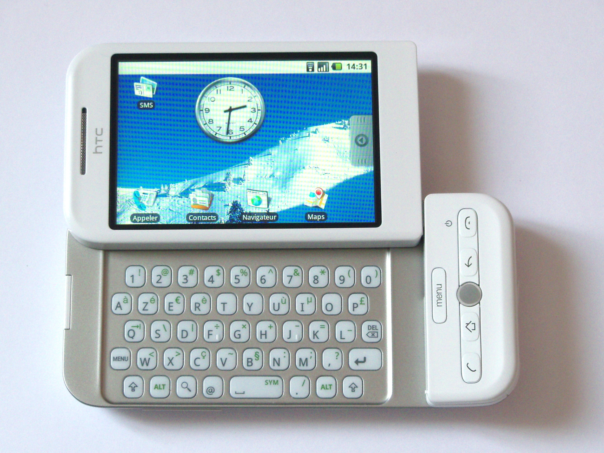
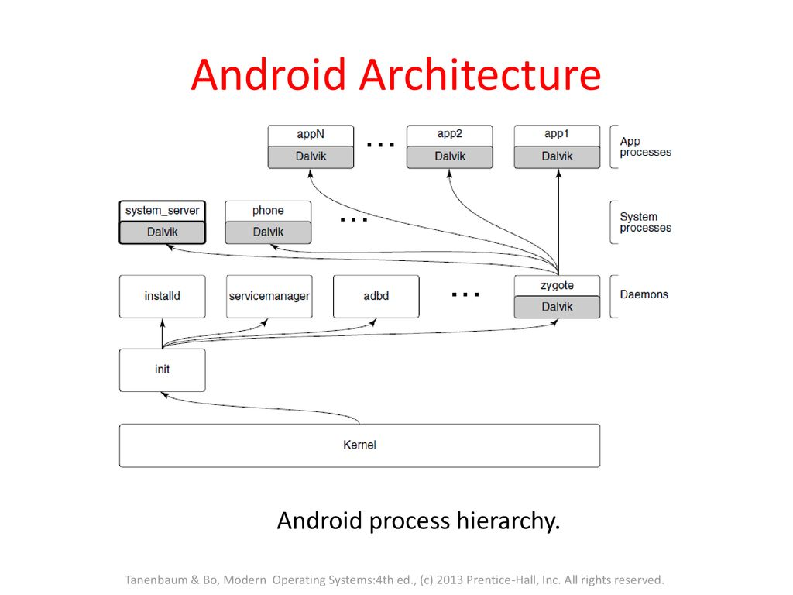
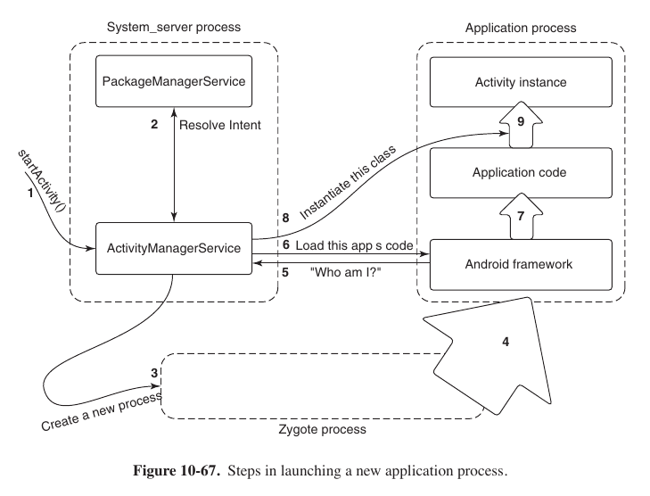
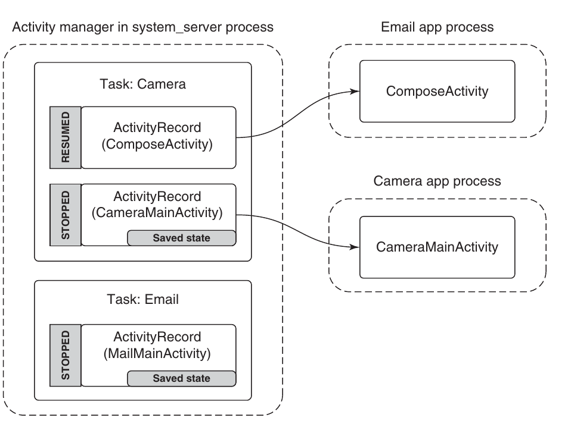

# Android

Android основан на ядре Linux, но использует многие стандартные концепты по-другому в силу специфики использования. Производители сильно кастомизируют систему, чтобы не ломать совместимость с приложениями, есть [Compatibility Definition Document](https://source.android.com/docs/compatibility/cdd). 

## История



Google купил стартап Android, Inc. который разрабатывал новую операционную систему для смартфонов. Изначально идея была поддержать для разработчиков Java, Javascript и C++, но в итоге было решено сконцентрироваться на первой. Телефоны планировалось поставлять с сервисами Google из коробки.

## Цели

1. Разработать open-source платформу для мобильных устройств
2. Сделать стабильный API для сторонних приложений. Предоставить равные условия Google и другим разработчикам.
3. Гибко регулировать разрешения сторонних приложений
4. Хорошо работать с типовыми сценариями: сделать фотографию на камеру и быстро отправить её по почте. Для этого нужно быстро переключаться между приложениями и предоставить им удобный механизм для коммуникации.

## Процессы

### Иерархия



У Android есть главный init процесс. Он стартует демоны для работы с файловой системой, оборудованием, и так далее. Также он запускает зиготу с JVM и основными библиотеками. JVM достаточно тяжёлый (даже Hello World потребляет несколько десятков мегабайт памяти), поэтому запускается не быстро. При этом пользовательские данные/код занимают не очень большую часть этого. Поэтому если форкать зиготу и потом подгружать пользовательский код, благодаря Copy-On-Write это будет работать достаточно быстро.

Первый его ребёнок -- system manager, который отвечает за оконную систему, менеджер пакетов и так далее. Также есть вечно работающие процессы вроде телефона.

### Безопасность

Обычно в Linux команда, которую вы исполняете, делает это под вашим пользователем и следовательно обладает всеми вашими разрешениями. В Android было решено не так сильно доверять пользователю, поэтому для каждой программы создаётся свой UID. Это позволяет изолировать программы и гибко управлять разрешениями. По-умолчанию у программы есть доступ только к своей папке с данными. 

Но что если мы хотим отправить фотографию из почтового клиента? Тогда мы должны запросить разрешение `READ_PICTURES`. При этом мы получаем возможность обратиться не к файловой системе напрямую, а к галерее как content provider'у (об этом ниже).

### Память

В Linux есть swap раздел, который позволяет сбрасывать редко используемые страницы памяти на диск. В Android диск представлен eMMC или SD картами. Вследствие этого:

1. Постоянной памяти очень мало. HTC Dream, например, имел 192МБ оперативной и 256МБ постоянной памяти.
2. Низкая скорость запись: 20МБ/с против 100-150МБ/с у традиционных жёстких дисков
3. Одна ячейка памяти выдерживает всего несколько тысяч циклов перезаписи.

> Сейчас во многих смартфонах используется более современный UFS. Он не так сильно страдает выше описанных недостатков, поэтому некоторые производители пишут кастомные ядра, которые позволяют использовать swap. 

То есть ситуация Out-Of-Memory, которая почти не происходит на обычных компьютерах, на Android происходит почти постоянно. Поэтому используется кастомный OOM-Killer, который запускается не когда память кончается, а когда её остаётся мало. Нам нужно чётко понимать приоритеты.

### Жизненный цикл



Пользователь запускает некоторые activity. Если соответствующего процесса нет, нужно форкнуть зиготу и запустить программу, если нет, можно просто послать ей сигнал.

Далее процесс попадает в один из классов с точки зрения OOM Killer.

| Категория   | Описание                                                                    | oom_adj |
|-------------|-----------------------------------------------------------------------------|---------|
| System      | Служебные процессы                                                          | -16     |
| Persistent  | Менее важные служебные процессы                                             | -12     |
| Foreground  | Приложение взаимодействует с пользователем                                  | 0       |
| Visible     | Приложение видно пользователю                                               | 1       |
| Perceptible | Пользователь видит эффект приложения (например в фоне проигрывается музыка) | 2       |
| Service     |                                                                             | 3       |
| Launcher    |                                                                             | 4       |
| Cached      | Не используемые процессы                                                    | 5       |

Тут стоит заметить, что в android приложениях нет чёткой точки выхода. Их просто прибивают время от времени, когда кончается память.

### Межпроцессорное взаимодействие

Для взаимодествия с другим процессом создаётся канал связи с помощью intent'а. Это операций возвращает Binder, который в некотором роде похож на файловый дескриптор. После этого общение происходит с помощью передачи сообщений (транзакций) через вызов Binder'а в отправителе и их обработки в callback в получаетеле.

Пример: https://web.archive.org/web/20130731024012/http://code.google.com/p/openmobster/wiki/InterAppCommunication

## Приложения

Android приложение представимо APK файло (уже нет). Есть [манифест](https://developer.android.com/guide/topics/manifest/manifest-intro), описывающий приложение, ресурсы (картинки, тексты) и код. В отличии от традиционных программ, в них нет единой точки входа, их несколько, и все они написаны в манифесте. В приложение почты можно войти, например, на главный экран, а можно попасть сразу на экран написания письма (например, при попытке отправить фото из галереи). Всей этой информацией управляет менеджер пакетов.

### Activity

Activity это то, что взаимодействует с пользователем через интерфейс. Например, экран написания сообщения.



Например, пусть мы хотим отправить по почте снимок. [Состояние](https://developer.android.com/topic/libraries/architecture/saving-states) камеры сохраняется на диск (помним, что из памяти нас могут в любой моент выгрузить), activity останавливается и система запускает activity почтового клиента.

### Service

Сервисы используется для фоновых задач, таких как синхронизация почты. 

### Receivers

Receivers это механизм callback'ов. Например, activity менеджер может прислать вашему receiver'у уведомление о том, что на телефоне заканчивается место. А callback может почистить кэш приложения.

### Content providers

Content providers это инструмент для обмена ифнормацией между приложениями. Вы можете писать Resolver'ы для url специального вида, который отдают данные. Например, содержимое первого сообщения. В примере с почтой

```
content://com.example.email.provider.email/messages/1
```

### Intent

Intent это намерение совершить действие обладающее определёнными свойствами. Например "написать письмо". В системе может быть несколько почтовых клиентов, тогда пользователю предложат выбрать один из них.


## Другое

Телефон должен как можно больше спать, чтобы  не тратить энергию. Просыпается он благодаря прерываниям от радиомодуля, например. Если вы пишете музыкальный плеер, например, нужно брать специальный Wake Lock, чтобы не спать. Wake lock всегда взят при включенном экране.
