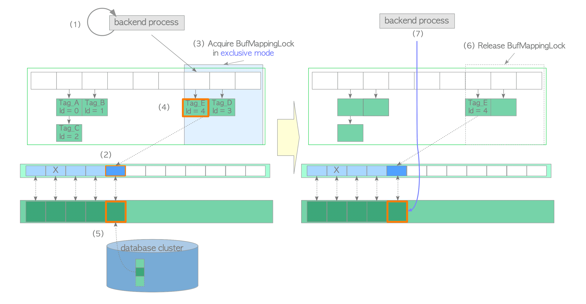
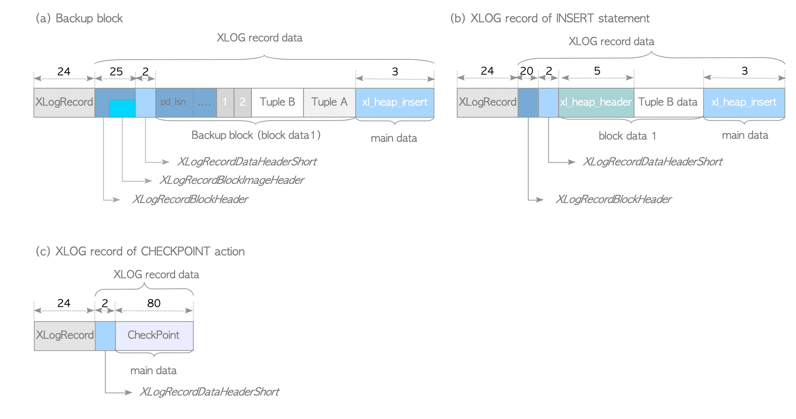
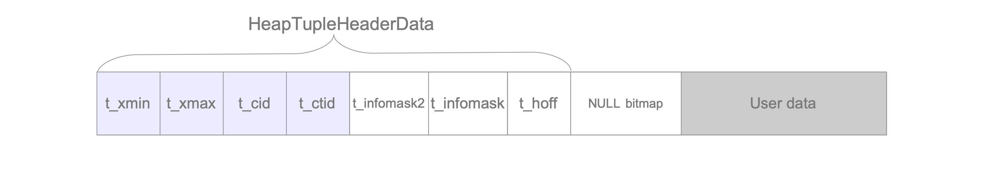
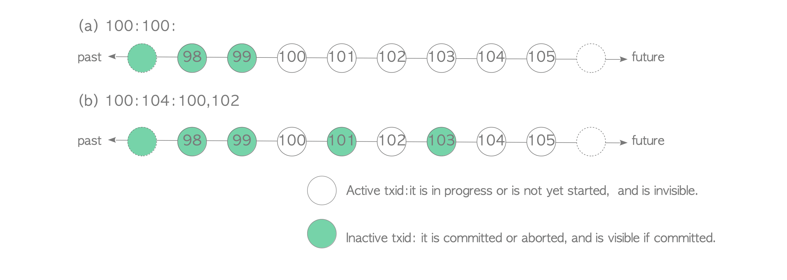

# PG internals

Inspired by Dmitriy Orlov and https://www.interdb.jp/pg

## Процессы

Давайте посмотрим, что у нас вообще запущено.

```
(base) arslan@arslan-zenbook:~$ ps aux | grep postgres
postgres    1329  0.0  0.3 218280 28324 ?        Ss   10:09   0:00 /usr/lib/postgresql/12/bin/postgres -D /var/lib/postgresql/12/main -c config_file=/etc/postgresql/12/main/postgresql.conf
postgres    1435  0.0  0.0 218384  6200 ?        Ss   10:09   0:00 postgres: 12/main: checkpointer   
postgres    1436  0.0  0.0 218280  5648 ?        Ss   10:09   0:00 postgres: 12/main: background writer   
postgres    1437  0.0  0.1 218280  9900 ?        Ss   10:09   0:00 postgres: 12/main: walwriter   
postgres    1438  0.0  0.1 218956  8084 ?        Ss   10:09   0:00 postgres: 12/main: autovacuum launcher   
postgres    1439  0.0  0.0  72780  4584 ?        Ss   10:09   0:00 postgres: 12/main: stats collector   
postgres    1440  0.0  0.0 218820  6432 ?        Ss   10:09   0:00 postgres: 12/main: logical replication launcher   
```

Запустим ``sample.py``, который читает содержимое таблицы и виснет на подключении на 10 секунд.

```
postgres    1329  0.0  0.3 218280 28324 ?        Ss   10:09   0:00 /usr/lib/postgresql/12/bin/postgres -D /var/lib/postgresql/12/main -c config_file=/etc/postgresql/12/main/postgresql.conf
postgres    1435  0.0  0.0 218384  6200 ?        Ss   10:09   0:00 postgres: 12/main: checkpointer   
postgres    1436  0.0  0.0 218280  5648 ?        Ss   10:09   0:00 postgres: 12/main: background writer   
postgres    1437  0.0  0.1 218280  9900 ?        Ss   10:09   0:00 postgres: 12/main: walwriter   
postgres    1438  0.0  0.1 218956  8084 ?        Ss   10:09   0:00 postgres: 12/main: autovacuum launcher   
postgres    1439  0.0  0.0  72780  4584 ?        Ss   10:09   0:00 postgres: 12/main: stats collector   
postgres    1440  0.0  0.0 218820  6432 ?        Ss   10:09   0:00 postgres: 12/main: logical replication launcher   
postgres   36200  0.0  0.1 219336 15768 ?        Ss   10:32   0:00 postgres: 12/main: postgres postgres 127.0.0.1(47498) idle in transaction
```

Последний процесс, видимо, занимается обработкой клиента. А что если запустить 3 клиентов параллельно?

```
(base) arslan@arslan-zenbook:~$ ps aux | grep postgres
postgres    1329  0.0  0.3 218280 28324 ?        Ss   10:09   0:00 /usr/lib/postgresql/12/bin/postgres -D /var/lib/postgresql/12/main -c config_file=/etc/postgresql/12/main/postgresql.conf
postgres    1435  0.0  0.0 218384  6200 ?        Ss   10:09   0:00 postgres: 12/main: checkpointer   
postgres    1436  0.0  0.0 218280  5648 ?        Ss   10:09   0:00 postgres: 12/main: background writer   
postgres    1437  0.0  0.1 218280  9900 ?        Ss   10:09   0:00 postgres: 12/main: walwriter   
postgres    1438  0.0  0.1 218956  8084 ?        Ss   10:09   0:00 postgres: 12/main: autovacuum launcher   
postgres    1439  0.0  0.0  72780  4584 ?        Ss   10:09   0:00 postgres: 12/main: stats collector   
postgres    1440  0.0  0.0 218820  6432 ?        Ss   10:09   0:00 postgres: 12/main: logical replication launcher   
postgres   40744  0.0  0.1 219336 15768 ?        Ss   10:35   0:00 postgres: 12/main: postgres postgres 127.0.0.1(42540) idle in transaction
postgres   40816  0.0  0.1 219336 15768 ?        Ss   10:35   0:00 postgres: 12/main: postgres postgres 127.0.0.1(47166) idle in transaction
postgres   40870  0.0  0.1 219336 15772 ?        Ss   10:35   0:00 postgres: 12/main: postgres postgres 127.0.0.1(47168) idle in transaction
```

Получается, Postgres, как и Apache, создаёт отдельный процесс для обработки каждого клиента. TODO: упомянуть про пулинг (Odyssey)

Можно посмотрет на соединение со стороны клиента.

```
(base) arslan@arslan-zenbook:~$ ps aux | grep python3
arslan    171763  4.0  0.2  47184 19596 pts/5    S+   14:38   0:00 python3 sample.py
(base) arslan@arslan-zenbook:~$ sudo lsof -p 171763 | grep postgres
lsof: WARNING: can't stat() fuse file system /run/user/1000/doc
      Output information may be incomplete.
python3 171763 arslan    6u     IPv4             886656      0t0     TCP localhost:41970->localhost:postgresql (ESTABLISHED)
```

Получается, что PostgreSQL использует TCP в качестве транспорта.

### Postmaster

``postmaster`` это главный процесс сервера, от которого наследуются остальные. Он считывает конфигурацию, пишет логи, а ещё слушает клиентов на порту (обычно 5432) и порождает клиентские процессы для их обслуживания. Попробуем снять с него backtrace.

```
(base) arslan@arslan-zenbook:~$ sudo gdb -p 1329 -ex 'thread apply all bt' --batch
Thread 1 (Thread 0x7f10b84ecec0 (LWP 1329)):
#0  0x00007f10bafb1f7a in __GI___select (nfds=5, readfds=0x7ffd35456630, writefds=0x0, exceptfds=0x0, timeout=0x7ffd35456590) at ../sysdeps/unix/sysv/linux/select.c:41
#1  0x000055dbf71b7426 in ?? ()
#2  0x000055dbf71b8f61 in PostmasterMain ()
#3  0x000055dbf6f44798 in main ()
```

Видим, что он висит в ``select`` (напомню, что это более старый аналог ``epoll``), как и наш игрушечный сервер с прошлых занятий. 

Поллинг в коде: https://github.com/postgres/postgres/blob/10b6745d313c6e8f3523306d3d415c57c9039c5d/src/backend/postmaster/postmaster.c#L1737

Документация: https://www.postgresql.org/docs/8.1/app-postmaster.html

### Checkpointer

Данные в Postgres сначала пишутся в WAL, а потому уже в основную память. (TODO: рассказать выше про вид страниц). Checkpointer убеждается, что все записи в WAL до определённого момента сброшены в память базы и позволяет обрезать его.

###  Bgwriter

Страницы меняются в памяти в BufferPool, становятся dirty, и их надо время от времени сбрасывать на диск. Этим и занимается BgWriter. Он периодически берёт локи и запускает метод Buffer Manager, который последовательно сбрасывает грязные страницы на диск.

https://github.com/postgres/postgres/blob/b9f0e54bc955ba3f6187d238b03c9c99c576a6af/src/backend/storage/buffer/bufmgr.c#L2495

https://stackoverflow.com/questions/71534378/what-are-the-difference-between-background-writer-and-checkpoint-in-postgresql

### WAL writer

WAL тоже живёт в оперативное памяти, и его время от времени надо сбрасывать на диск. С помощью ``lsof`` можно увидеть, что она постоя

```
(base) arslan@arslan-zenbook:~$ sudo lsof -p 1437 | grep main
lsof: WARNING: can't stat() fuse file system /run/user/1000/doc
      Output information may be incomplete.
postgres 1437 postgres  cwd       DIR    8,9     4096 2654631 /var/lib/postgresql/12/main
postgres 1437 postgres    1w      REG    8,9    17531 2634965 /var/log/postgresql/postgresql-12-main.log
postgres 1437 postgres    2w      REG    8,9    17531 2634965 /var/log/postgresql/postgresql-12-main.log
postgres 1437 postgres    3u      REG    8,9 16777216 2634971 /var/lib/postgresql/12/main/pg_wal/000000010000000000000001
```

https://github.com/postgres/postgres/blob/ce340e530d1f76367379a8d230ad5f411e5f25d2/src/backend/access/transam/xlog.c#L2197

https://www.postgresql.org/docs/current/wal.html

### AutoVacuum

При удалении из базы строки не удаляются сразу физически. Время от времени происходит Vacuum, который дефрагментирует страницы на диске.

https://www.postgresql.org/docs/current/sql-vacuum.html

### PgStat

Фоновый процесс, собирающей различную статистику. Она, например, позволяет понять, какой план запроса будет более выгодным.

https://www.postgresql.org/docs/current/monitoring-stats.html

### LogicalReplicator

Подписывается на WAL мастера и последовательно его применяет.

https://www.postgresql.org/docs/current/logical-replication.html


## Хранение

### Heap

Данные таблицы хранятся в Heap файлах, разделённых на страницы (обычно по 8КБ). Основные компоненты:

* Заголовок, содержащий служебную информацию (например номер последней применённой записи из WAL)
* Указатели на tuple
* Сами tuple, хранящие данные строк


Про индексы можно почитать в серии статей от PostgresPro: https://postgrespro.com/blog/pgsql/3994098

### Buffer pool

Обращаться каждый раз к диску довольно трудозатратно, поэтому страницы кэшируются в оперативной памяти. Алгоритм вытеснения обычно используется Clock.



### WAL

Транзакция сначала пишет данные в WriteAheadLog. В случае коммита в нём ставится специальная отметка, и изменения применяются к соответствующим heap файлам.



## MVCC

PostgreSQL поддерживает транзакции с уровнем изоляции вплоть до Serializable. Уже для того, чтобы не видеть незакомиченные изменения чужих транзакций, нам нужно поддерживать несколько версий одной и той же строки. Как это реализовано? 

### Версионирование tuple



Транзакции имеют сквозную нумерацию. В каждом tuple есть некоторые служебные поля:

* ``t_xmin`` номер создавшей транзакции
* ``t_xmax`` номер изменившей транзакции
* ``t_cid`` номер операции в создавшей транзакции
* ``t_ctid`` указатель на более свежую версию (или себя). Кодируется парой, первый элемент которой номер страницы, а второй номер tuple в ней.

Таким образом вставка/удаление tuple означают добавление нового tuple и переподвешивание на него ``t_ctid`` прошлой версии.


## clog

Для каждой транзакции в памяти хранится массив с обозначением её статуса (``IN_PROGRESS || COMMITED || ABORTED``). Для текущего состояния транзакций используется кодирование ``xmin:xmax:xip_list``, где
* ``x_min`` номер минимальной активной транзакции
* ``x_max`` номер следующей транзакции
* ``xip_list`` список выполняющися транзакций



``Read Commited`` транзакции пересчитывают видимый Snapshot через ``x_min`` после каждой команды в запросе, ``Repeatable Read`` и выше фиксируют его в момент начала транзакции.

## Проверки видимости

Вооружившись это информацией можно начать выводить правила видимости tuple.

1. ``Status(t_xmin) = ABORTED => Invisible`` игнорируем tuple от отменённых транзакций
2. ``Status(txmax) = IN_PROGRESS ^ t_xmin = current_txd ^ t_xmax = INVALID => Visible`` транзакция видит свои изменения

И так далее.

### Разрешение конфликтов

* wr-конфликты разрешаются благодаря проверкам видимости
* ww-конфликты разрешаются так, что выигрывает первая пишущая транзакция, а вторая отменяется
* rw-конфликты разрешаются через локи

В момент доступа для объекта (Tuple || Page|| Table), создаётся SIREAD лок, в котором записываются номера транзакций, которые пытаются его прочитать. Если в локе объекта оказываются читающая и пишущая транзакция, одна из них отменяется?


### Vacuum

Понятно, что у вас начнут скапливаться невидимые tuple т. е. такие, чем ``t_xmax`` сильно меньше номера текущий транзакции и их нужно в фоне удалять. Будем называть их мёртвыми. Их удаление занимается фоновый процесс Vacuum. Он проходит в несколько стадий:

1. Поиск dead tuples и удаление их из индексов
2. Удаление dead tuples и дефрагментация страниц
3. Пересчёт статистики
