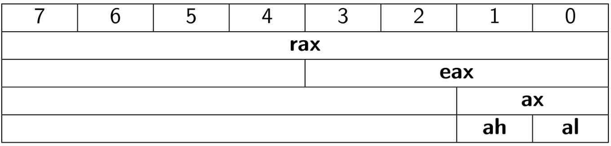
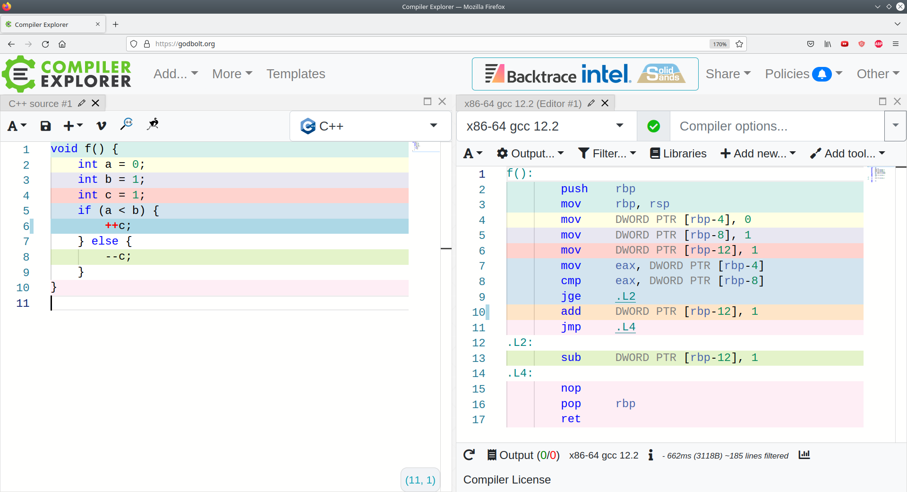

<style>
img[alt~="center"] {
  display: block;
  margin: 0 auto;
}
img[alt$=">"] {
  float: right;
  clear: none;
}
</style>

# Ассемблер x86

---
# Програмное управление

* Программа и данные хранятся в оперативной памяти
* Программа кодируется в виде инструкций процессора
* Шаги выполнения инструкции:
    1. Instruction fetch
    2. Instruction decode and register fetch
    3. Execute
    4. Memory access
    5. Register write back 

---
# Ассемблер

* Максимально приближен к машинному коду
* Вследствие этого платформозависимый

---
# CISC vs RISC
 
* Complex(Reduced) Instruction Set Computers
* x86 CISC, ARM RISC
* Переменная длина инструкции и больше набор инструкций
* Сложности с пайпланингом
* Инструкции исполняются разное число тактов

---
# Регистры

* Очень быстрые ячейки памяти на самом процессоре
* по 64 бита на x86-64
* числа в two-complement little endian
* Регистры общего назначения: `rax, rbx, rcx, rdx, rsi, rdi, r8-r15`
* Специальные: `rbp`, `rsp`, `rip`, `rflags`, ...

---
# Вложенность регистров



---
# Команды

```
label_name:
  cmd op1, op2, ...
```

Типы операндов команд:
* imm — константы
* r — регистры
* m — память

Хотя бы один из операндов должен быть регистром.

---
# Intel vs AT&T синтаксисы

Intel: `mov rax, [rax, 2 * rcx + 0x10]`
AT&T: `mov 0x10(%rax, %rcx, 2), %rax`

---
# Работа с памятью

* `mov` загружает значение ячейки памяти
* `lea` загружает адрес ячейки памяти

Например: `mov rax, [rsi]`

---
# Арифметика 

* add
* sub
* mul
* div

Например: `add dst, src`

---
# Флаги

* Регистр EFLAGS содержит специальные
биты-флаги результата операции
* Основные флаги:
  * `ZF` в результате операции получился `0`
  * `SF` результат отрицательный
  * `OF` знаковое переполнение
  * `CF` беззнаковое переполнение

---
# Примеры выставления флагов

Для простоты будем рассуждать в терминах 4-битных чисел:

* `0x0001 - 0x0001 = 0x0000` (выставится `ZF`)
* `0x0000 - 0x0001 = 0x1111` (выставится `SF`)
* `0x1111 + 0x0001 = 0x0000` (выставится `CF`)
* `0x0111 + 0x001 = 0x1000` (выставится `OF`)

---
# Вычисление флагов

* Есть инструкции для вычисления флагов без изменения регистров общего назначения
* Результат используется для условных переходов
* `cmp` (аналог `sub`)
* `test` (аналог `and`)

---
# Переходы

* `j** label_name` перейти на метку
* `jmp` безусловный переход
* `jz` перейти, если выставлен `ZF`
* Для знакомых чисел `jl`, `jle` и т. д.
* Для беззнаковых чисел `jb`, `jbe` и т. д.

---
# Godbolt



---
# Calling conventions

<table>
<tr>
<td>
<ul>
<li><tt>rsp</tt> указывает на вершину стека</li>
<li>Первые 6 аргументов передаются в регистрах <tt>rdi, rsi, rdx, rcx, r8, r9</tt>, остальные на стеке</li>
<li>Возвращается значение в <tt>rax</tt></li>
<li>При вызове функции через <tt>call</tt> на вершину кладётся адрес возврата</li>
<li><tt>ret</tt> достаёт со стека адрес возврата и переходит по нему</li>
</ul>
</td>
<td>

</td>
</tr>
</table>


---
# Calling conventions

* При вызове функций вершин стека (`rsp`) должна быть выровнена по 16 байт
* Нужно сохранить значения `rax, rdi, rsi, rdx, rcx, r8, r9, r10, r11`, если они вам нужны
* `rbx, rsp, rbp, r12, r13, r14, r15` нужно вернуть в неизменном виде после выхода из функции

---
# Векторные регистры

* SIMD (single instruction multiple data)
* SSE/AVX/AVX-512
* `xmm0-xmm15`, `ymm0-ymm15`, `zmm0-zmm15`, caller-saved
* Аргументы передаются в `xmm0-xmm7`
* Возвращаемое значение в `xmm0`

---
# Скалярные инструкции

Суффикс `sd` означает `double`, `ss` означает `float`.

* Арифметика: `addsd dst, src`
* Преобразование типов: `cvtsi2sd dst, src`
* Сравнение: `comisd dst, src`

---
# Векторные инструкции

Общий вид: `op[ap|up][s|d] dst, src`

* `ap` для загрузки из памяти, выровненной по длине регистра
* `s` для `float`, `d` для `double`

Пример: `addps xmm0, xmm1`

Для AVX: `vaddps xmm0, xmm1, xmm2`

---
# Intrinsics

Расширения компилятора, позволяющие использовать векторные инструкции в коде на C.

```
for (int i = 0; i < n; i+= 8) {
    __m256 r1 = _mm256_load_ps(a + i);
    __m256 r2 = _mm256_load_ps(b + i);
    __m256 r3 = _mm256_add_ps(r1, r2);
    _mm256_store_ps(&c[i], r3);
}
```


---
# The End
