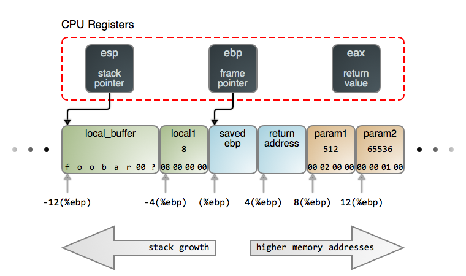

# Инструментарий разработчика

## GCC 

> Вопросы в аудиторию:
> * Что такое компилятор?
> * Зачем писать новые компиляторы?
> * Можно ли будет любую программу этого курса скомпилировать на Apple M1, например?

В это курсе мы будем использовать компилятор ``gcc``. В простейшем случае, чтобы скомпилировать программу из одного файла, можно просто написать ``gcc file.c``. Называться по-умолчанию выходной бинарный файл будет ``a.out``. Переопределить это имя можно с помощью опции ``-o``.

## Этапы компиляции

> Вопрос в аудиторию: Может у кого-то свежи воспоминания с курса ТП/C++, и он может рассказать?

Давайте рассмотрим этапы компиляции на примере простой программы ``aplusb.c``.

1. Препроцессинг: разворачиваются `include` и `define`, удаляем комментарии. Выполним только эту стадию: ``gcc -E aplusb.c -o aplusb_preprocessed.c``
> Что за комментарии препроцессор оставляет в начале? Хорошо написано здесь: https://stackoverflow.com/questions/49109904/how-to-interpret-prefixed-lines-in-c-preprocessor-output
2. Компиляция: код на C превращается в ASM
> На самом деле ASM не обозначает какой-то один язык. Это семейство низкоуровневых платформоспецифичных языков. На курсе мы с вами будем разбирать ARM и x86 диалекты, но есть и множество других для менее известных архитектур. 

``gcc -S aplusb_preprocessed.c -o aplusb_asm.S``

3. Ассемблирование: код на ассемблере преобразуется в машинный код.

``gcc -c aplusb_asm.S -o aplusb_object.o``

В целом, ассемблер и так сильно к нему приближен. С помощью утилиты ``objdump`` можно удобно рассматривать объектные файлы. В частности, флаг ``-d`` позволяет посмотреть на ассемблерный код.

4. Компоновка/Линковка: объектные файлы собираются в один бинарный

``gcc aplusb_object.o -o aplusb_executable.out``

## Makefile

Удобно выполнять сборку одно командой ``gcc`` в случае, если надо собрать проекты из пары файлов. Для больших проектов нужен некий инструмент автоматизации, системы сборки. Одна из простейших из них -- `make`. `Makefile` состоит из целей, которые берут некоторые зависимости и применяют к ним команды сборки. Для примера можно посмотреть на цели для этапов сборки из прошлого раздела. 

Make не хранит своё состояние. Поэтому пересборка цели не выполняется лишь в одном случае: имя цели является файлом, и время его модификации больше времени модификации всех зависимостей цели.

> Подробнее можно почитать на https://makefiletutorial.com/. Ещё подробнее в официальной документации: https://www.gnu.org/software/make/manual/make.html

## GDB

Опция ``-g`` позволяет снабдить файл дополнительной информацией для отладки.

``gcc -g sum_cli.c -o sum.out``

Запустим бинарный файл под отладчиком 

``gdb ./sum.out``

Поставим точку останова: ``b 7``

Запустим исполнение: ``run < in.txt`` (для простоты сделаем ввод из файла).

С помощью ``layout src`` можно посмотреть на исходный код.

Дальше с помощью ``ni`` можно переключаться на следующую инструкцию (если нужно зайти в функции, используем ``si``).

С помощью ``print`` можно вывести значения переменной.

Чтобы выйти из отладки, можно использовать команду ``q``.

> Шпаргалка по GDB https://darkdust.net/files/GDB%20Cheat%20Sheet.pdf

Попробуем под ``gdb`` запустить падающую программу.

``gcc -g bad.c -o bad.out``

Чтобы сразу выполнить программу, можно передать команды в аргумент ``ex``.

``gdb -ex=r ./bad.out``

Видим строчку, в которой произошёл Segfault. 

С помощью команды ``bt`` можно вывести stacktrace. 

> Картинка из статьи https://manybutfinite.com/post/journey-to-the-stack/. Что такое eax, esp и ebp, узнаете на лекции про ассемблер.

Дальшё с помощью ``frame 0`` можно переключиться на верхний фрейм.

``info args`` покажет аргументы, с которыми была вызвана функция.

``info locals`` выведет локальные переменные.

> В прошлых двух мы тоже вышли за границы массива, но почему-то не упали. Узнаете, почему, когда сходите на лекцию про виртуальную память процесса.

В жизни часто возникает необходимость проанализировать на падение программы, в которой были отладочные символы, но запущена она была не под дебаггером. Для этого используются специальные ``coredump`` файлы, которые сохраняют состояние процесса на момент падения.

Попросим складывать файлы в текущую папку:

``sudo sysctl kernel.core_pattern="./coredump"``

Разрешим создавать ``coredump`` файлы большого размера и выполним программу.

``ulimit -c unlimited; ./bad.out``

Теперь можно проанализировать ``coredump``. 

``gdb ./bad.out ./coredump``

Ну а дальше можно повторить все манипуляции, которые мы делали ранее.

## Sanitizers

Обычно проблемы целесообразно ловить на как можно более ранних этапах. В прошлом пункте мы разобрались, как можно проанализировать упавшую программу, в этом разбёремся, как частично отлавливать их на этапе компиляции. Скопмпилируем нашу программу под Adress Sanitizer'ом.

``gcc -fsanitize=address bad.c -o bad.out``

Можно заметить, что размер бинарного файла увеличился, потому что сгенерировались некоторые дополнительные проверки.

Зато теперь, если мы запустим программу, увидим сильно более понятное сообщение об ошибке.

## Strace

На лекции рассказали про то, что ядро предоставляет некоторый API системных вызовов. Они используются, например, для взаимодействия с железом, создания процессов и межпроцессорной коммуникации. С помощью утилиты ``strace`` можно посмотреть список системных вызовов, которые вызывает ваша программа.

``strace ./sum.out``

В начале мы выделяем память, потом загружаем в неё динамические библиотеки, после этого считываем и записываем данные с помощью системных вызовов ``read`` и ``write``, и, наконец, завершаем программу с помощью системного вызова ``exit``.