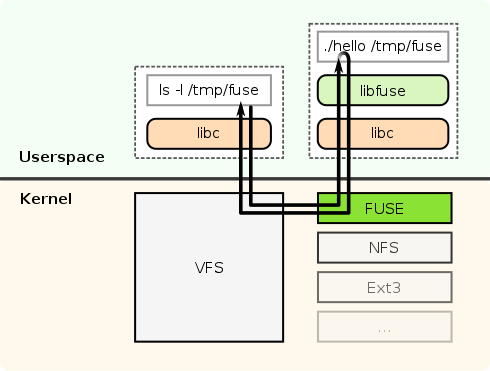

# Файловый ввод-вывод

## Файловые дескрипторы

Файл это практически любая именованная сущность для работа с данными. Файловый дескриптор это числовой идентификатор файла внутри процесса. Примеры стандартных файловых дескрипторов: ``0 stdin, 1 stdout, 2 stderr``.

## Open/Close

Системный вызов ``open`` предназначен для создания файлового дескриптора по имени файла.

```
int open(const char *path, int flags, ... /* mode_t mode */);
// путь к файлу
// flags O_RDONLY, O_WRONLY, ..., O_CREAT
```

Основные параметры открытия файлов:
 * `O_RDONLY` - только для чтения;
 * `O_WRONLY` - только на запись;
 * `O_RDWR` - чтение и запись;
 * `O_APPEND` - запись в конец файла;
 * `O_TRUNC`- обнуление файла при открытии;
 * `O_CREAT` - создание файла, если не существует;
 * `O_EXCL` - создание файла только если он не существует.

В случае успеха возвращается неотрицательное число - дескриптор, в случае ошибки - значение `-1`.

Третий аргумент отвечает за права.

В случае создания файла, обязательным параметром является набор POSIX-аттрибутов доступа к файлу. Как правило, они кодируются в восьмеричной системе исчисления в виде `0ugo`, где `u` - права доступа для владельца файла, `g` - права доступа для всех пользователей группы файла, `o` - для остальных.

В восьмеричной записи значения от 0 до 7 соответствуют комбинации трёх бит, где `r` это чтение, `w` запись, а `x` исполнение:
```
00: ---
01: --x
02: -w-
03: -wx
04: r--
05: r-x
06: rw-
07: rwx
```

## Read/Write

Чтение и запись осуществляются с помощью системных вызовов:

```
ssize_t read(int fd, void *buf, size_t count);
ssize_t write(int fd, const void *buf, size_t count);
// count максимальне количество байт, должно быть меньше размера буффера.
```

Возвращают они количество прочитанных/записанных байт. Гарантируется, что в случае успеха они считают ненулевое число байт, но необязательно все доступные данные. Поэтому читать/писать нужно в цикле (см. `read_buff.c`).

## Seek

Во время чтения из файла мы последовательно двигаем курсор. Есть возможность управлять им вручную с помощью специального системного вызова:

```
off_t lseek(int fd, off_t offset, int whence);
// offset from whence
// whence = SEEK_SET|SEEK_CUR|SEEK_END (begin of file/current offset/end of file)
```

Возвращает системный вызов текущее смещение. Для 64-битных отступов:

```
#define _FILE_OFFSET_BITS 64
```

Пример использования можно посмотреть в `lseek_demo.c`.

## pread/pwrite

Есть также системные вызовы для чтения/записи по заданному отступу. Позиция курсора от их использованиям не меняется.

```
ssize_t pread(int fd, void *buf, size_t count, off_t offset);
ssize_t pwrite(int fd, const void *buf, size_t count, off_t offset);
```

Пример использования можно посмотреть в `pread_demo.c`.

## readv/writev

Атомарно можно считывать данные в несколько буферов. Это позволяет более удобно и эффективно обращаться с массивами данных.

```
ssize_t readv(int fd, const struct iovec *iov, int iovcnt);
ssize_t writev(int fd, const struct iovec *iov, int iovcnt);
```

Пример использования можно посмотреть в `writev_demo.c`. Аналогично есть системные вызовы:

```
ssize_t preadv(int fd, const struct iovec *iov, int iovcnt, off_t offset);
ssize_t pwritev(int fd, const struct iovec *iov, int iovcnt, off_t offset);
```

## Атрибуты файлов

### Жёсткие и символические ссылки

Ссылки на файлы бывают двух типов:

* Жёсткие - ещё одно имя для файла
* Мягкий - ссылка на файл по конкретному пути. Это означает, что они инвалидируются при переименовании.

Создавать их можно, например, с помощью команды `ln`. По-умолчанию создаётся жёсткая ссылка, с опцией `-s` -- мягкая. Например:

```
ln -s in.txt in_soft.txt
```

Есть и системные вызовы для работы с ними `link`, `unlink`, `symlink`, `readlink`.

### Метаинформация о файле. Структура stat.

С каждым файлом связана метаинформация, представимая структурой `stat`:

```
struct stat {
   dev_t     st_dev;         /* ID of device containing file */
   ino_t     st_ino;         /* Inode number */
   mode_t    st_mode;        /* File type and mode */
   nlink_t   st_nlink;       /* Number of hard links */
   uid_t     st_uid;         /* User ID of owner */
   gid_t     st_gid;         /* Group ID of owner */
   dev_t     st_rdev;        /* Device ID (if special file) */
   off_t     st_size;        /* Total size, in bytes */
   blksize_t st_blksize;     /* Block size for filesystem I/O */
   blkcnt_t  st_blocks;      /* Number of 512B blocks allocated */

   struct timespec st_atim;  /* Time of last access */
   struct timespec st_mtim;  /* Time of last modification */
   struct timespec st_ctim;  /* Time of last status change */

   /* Backward compatibility */
   #define st_atime st_atim.tv_sec      
   #define st_mtime st_mtim.tv_sec
   #define st_ctime st_ctim.tv_sec
};
```

Получить её можно с помощью системных вызовов

```
int (l)stat(const char *file_name, struct stat *stat_buffer)
```

Версия с `l` не переходит по символическим ссылкам.

Есть ещё версия для работы с файловыми дескрипторами. Она хороша тем, что пока файл открыт, он не удаляется с диска.

```
int fstat(int fd, struct stat *stat_buffer)
```

В `st_mode` кроме разрешений закодирован тип файла. Проверить его можно с помощью макросов:
* `S_ISREG` регулярный
* `S_ISDIR` папка
* `S_ISLNK` символическая ссылка

Проверить уровень доступ текущего пользователя к файлу можно с помощью `access`.

```
int access(const char *path_name, int mode);
// mode = R_OK | W_OK | X_OK
```

Он возвращает 0, если у пользователя есть доступ.

Примеры использования этих системных вызовов можно найти в `count_filetypes.c`.

## Работа с директориями

Директория это специальный тип файлов, который хранит отображение из имен файлов в номера inode. Файловая система отвечает за консистентность содержимого директории, поэтому для работы с ней предназначены отдельные функции. В директории всегда есть `.` и `..` жесткие ссылки на текущую директорию и предка.

Для начала нужно получить дескриптор на директорию.

```
DIR *opendir(const char *name);
int closedir(DIR *dirp);
```

С его помощью можно итерироваться по содержимому директории (на порядок нет никаких гарантий). 

```
struct dirent *readdir(DIR *dirp);
```

Каждый элемент директории представляется специальной структурой:

```
struct dirent {
   ino_t          d_ino;       /* Inode number of file */
   off_t          d_off;       /* Not an offset in modern systems; do not use */
   unsigned short d_reclen;    /* Length of this record */
   unsigned char  d_type;      /* Type of file */
   char           d_name[256]; /* Null-terminated filename */
};
```

Пример использования функций можно найти в `list_dir.c`.


## Работа со временем

TODO

## FUSE

Файл это именованная сущноть, хранящая данные. Аналогично файловая системы система это хранилище файлов и их атрибутов в некоторой древовидной структуре. То есть нужно, чтобы были реализованы системные вызовы `open`, `stat`, `read` и другие системные вызовы. VFS (virtual file system) -- интерфейс, реализацией которого являются конкретные файловые системы, такие как `ext4` или `tmpfs`.. Напрямую реализовывать интерфейсы из VFS довольно трудоёмко. Тут на помощь приходит библиотека FUSE (File System in Userspace), которая позволяет проксировать системные вызовы вашей программе, работающей в userspace. В составе FUSE есть модуль ядра, который проксирует системные вызовы, направляя их вашей программе.



Для реализации своей файловой системы нужно прописать структуру `fuse_operations`. В примере из папки `fuse` используются несколько основных вызовов, полный список можно найти в документации: https://libfuse.github.io/doxygen/structfuse__operations.html

Запуск `./fuse_demo foo --src kek.txt` (директория `foo` должна существовать и быть пустой). После использования нужно не забыть отмонтировать `fusermount -u foo`. Для отладки рекомендуется вызывать под `strace` стандартные команды такие как `stat`, `ls` и другие.
