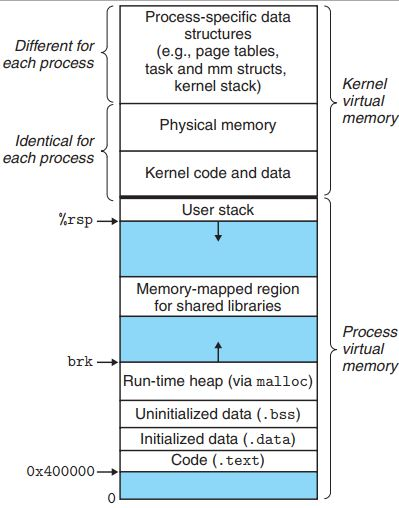

# Стек и вызов функций

## Секции

У каждого процесса есть своё виртуальное адресное пространство (подробнее об этом через несколько занятий). В рамках него память разделена на несколько секций.

* `.text` хранит код программы
* `.data` хранит глобальные инииализрованные переменные
* `.bss` хранит неинициализированные глобальные переменные

С кучей и стеком вы уже знакомы из прошлых курсов. Важно про них запомнить, что стек растёт вниз, а куча наверх (по адресам).

Когда мы в прошлых программах писали `.text` в начале это означало, что то, что будет дальше, нужно загрузить в соответствующую секцию в памяти.

Чтобы обращаться к глобальным переменным, нужно воспользоваться секцией `.data`. Пример использования можно посмотреть в `globals_echo.S`. TODO: Не работает

## Calling conventions

Для сохранения адреса возврата надо использовать команду `bl`, а не `b`.

Напомним, что аргументы в функцию передаются через регистры `x0 ... x7`, возвращаемое значение через `x0, x1`.

> Про Calling Conventions можно почитать в [официальной документации](https://developer.arm.com/documentation/102374/0100/Procedure-Call-Standard).

## Макросы

С обычным стеком мы привыкли взаимодейстововать с помощью операций `push` и `pop`. В AArch64 стек должен быть выровнен по 16 байт, то есть складывать 8-байтные регистры по одному в общем случае не получится. Что с этим можно делать, можно почитать в [статье](https://community.arm.com/arm-community-blogs/b/architectures-and-processors-blog/posts/using-the-stack-in-aarch64-implementing-push-and-pop).

Как один из вариантов, мы можем реализовать макросы `push` и `pop`, но пользоваться ими аккуратно. Вообще проблемы возникнут, когда мы будем вызывать какие-то функции. А внутри своей функции мы можем двигать `sp` как хотим. 

``
.macro push Rn:req
    sub sp, sp, 8
    str \Rn, [sp]    
.endm

.macro pop Rn:req
    ldr \Rn, [sp]
    add sp, sp, 8
.endm
``

Пример использования можно посмотреть в `int_echo.S`.
