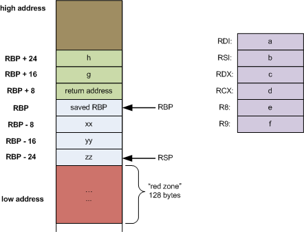

# Ассемблер x86_64

Поговорим об ассемблере для архитектуры x86_64. В отличии от ARM, x86_64 CISC архитектура, то есть набор команд сильно больше и кодируется различным числом байт. TODO: мотивация

Неплохой справочник команд можно найти [здесь](https://www.felixcloutier.com/x86/).

У x86_64 есть ещё и несколько видов синтаксиса. Наиболее близкий из них, Intel, включается с помощью следующей опции, которую надо написать в начало исходника:

```
.intel_syntax noprefix
```

## Регистры и соглашения о вызовах

В Linux предусмотрены следующие соглашения об использовании регистров:

| Регистры        | Назначение                                                   |
| --------------- | ------------------------------------------------------------ |
| `rax`   | возвращаемое значение функции         |
| `rdi, rsi, rdx, rcx, r8, r9` | аргументы функции, последующие кладутся на стек |
| `rax, rdi, rsi, rdx, rcx, r8, r9, r10, r11`  | временные регистры, для которые не гарантируется сохранение результата, если вызывать какую-либо функцию |
| `rbx, rsp, rbp, r12, r13, r14, r15` | регистры, для которых гарантируется, что вызываемая функция их не будет портить |
| `rbp`           | указатель на границу фрейма функции, обычно используется отладчиком |
| `rsp`      | указатель на вершину стека                                   |

Обращаться к младшим 32 битам можно заменяя `r` на `e` (например `eax`) в начале имени регистра или дописывая `d` в случае номерных (например `r13d`).

В отличии от ARM, для перегонки значений в оперативную память и обратно не нужны отдельне команды `LDR` и `STR`. Всё это умеет делать обычный `mov`.

`mov register [base + index * scale + offset]` служит аналогом `LDR`, аналогично получается аналог `STR` если переставить аргументы местами. Обратите внимание, что такой синтаксис крайне удобен для работы с массивами. Поэтому функция для получения элемента массива в `arr_get.S` имеет всего одну смысловую строку (в [ARM версии](https://github.com/Khabutdinov-Arslan/caos-seminars/blob/main/sem04-arm-asm-basics/arr_get.S) было 3). 

Для загрузки в регистры чисел меньшей размерности служат суффиксы. Например, `movsxd` позволяет загружать знаковые 32-битные числа.

## Арифметические команды

Общий вид команд: `CMD left, right` отвечает за операцию `left*=right`. Например: `ADD r8, r9` прибавляет к значению регистра `r8` значения регистра `r9`.

```
add     DST, SRC        /* DST += SRC */
sub     DST, SRC        /* DST -= SRC */
inc     DST             /* ++DST */
dec     DST             /* --DST */
neg     DST             /* DST = -DST */
mov     DST, SRC        /* DST = SRC */
imul    SRC             /* (eax,edx) = eax * SRC - знаковое */
mul     SRC             /* (eax,edx) = eax * SRC - беззнаковое */
and     DST, SRC        /* DST &= SRC */
or      DST, SRC        /* DST |= SRC */
xor     DST, SRC        /* DST ^= SRC */
not     DST             /* DST = ~DST */
cmp     DST, SRC        /* DST - SRC, результат не сохраняется, */
test    DST, SRC        /* DST & SRC, результат не сохраняется  */
adc     DST, SRC        /* DST += SRC + CF */
sbb     DST, SRC        /* DST -= SRC - CF */
```

## Метки и переходы

Аналогично ARM можно создавать метки и использовать команду `cmp` для сравнения значений. Она выставляет те же флаги, что и в aarch64.

Для безусловного перехода служит команда `jmp`. Условные переходы:

```
jz      label   /* переход, если равно (нуль), ZF == 1 */
jnz     label   /* переход, если не равно (не нуль), ZF == 0 */
jc      label   /* переход, если CF == 1 */
jnc     label   /* переход, если CF == 0 */
jo      label   /* переход, если OF == 1 */
jno     label   /* переход, если OF == 0 */
jg      label   /* переход, если больше для знаковых чисел */
jge     label   /* переход, если >= для знаковых чисел */
jl      label   /* переход, если < для знаковых чисел */
jle     label   /* переход, если <= для знаковых чисел */
ja      label   /* переход, если > для беззнаковых чисел */
jae     label   /* переход, если >= (беззнаковый) */
jb      label   /* переход, если < (беззнаковый) */
jbe     label   /* переход, если <= (беззнаковый) */
```

Пример реализации цикла можно найти в `sum_n.S`.

## Стек и вызов функций




Переход по метке функции осуществляется командой `call label_name`, которая кладёт адрес возврата на стек, подменяет его на следующую команду после `call` и передаёт управление функции. Для выхода из функции служит команда `ret`.

На картинке можно видеть, что после адреса возврата лежит RBP. Во времена 32-битных систем стандартом было поддеживать текущий stack frame. Первое, что делалось внутри функции при вызове -- сохранение прошлого начала стека. Следующая конструкция называлось прологом

```
push rbp
mov rbp, rsp
```

В конце функции принят был эпилог

``
mov rsp, rbp
pop rbp
``

Сейчас это необязательно, потому что компилятор в состоянии высчитать все адреса от вершины стека. Но вам самим в коде может быть удобно адресовать локальные переменне от RBP, потому что RSP менятся.
