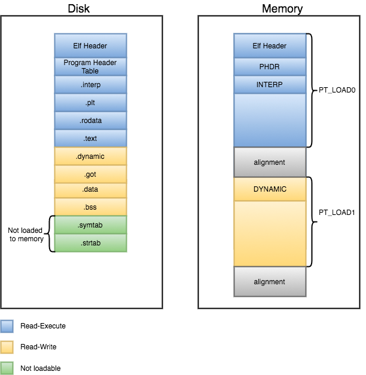

# Процессы

Процесс -- экземпляр исполнения программы.


В ядре операционной системы хранится таблица процессов. Наиболее существенные аттрибуты

* Для восстановления состояния процесса при переключении, нам нужно сохранить:
    * `pc` указатель на следующую инструкцию
    * `sp` указатель на стек
    * сами регистры можно просто сохранять на стек при преключении или хранить отдельно
    * состояние процесса (их диаграмма будет ниже)
* Для контроля за процессами нужно помнить:
    * `pid` идентификатор процесса
    * `pid` родителя, чтобы оповещать его об изменении статусов ребёнка
    * `uid` и `gid` для квотирования ресурсов
* Планировщику нужно знать
    * приоритет
    * время исполнения
* Для работы с файлами нужно хранить:
    * таблицу фаловых дескрипторов
    * текущую директорию, от которой считаются относительные пути (напомню, что это причина, по которой нет утилиты `cd`)
    * корневую директорию, от которой считаются абсолютные пути. Это, в частности, позволяет изолировать процессы друг от друга.


Процесс может находится в разных состояниях:
* Выполняется
* Остановлен (до получения сигнала `SIGCONT`, о них поговорим позже)
* Сон (например, ждёт ввода)
* Зомби (процесс завершился, но ещё не удалён из таблицы процессов)

## ELF

ELF (Executable and Linkable Format) это стандартный формат исполняемых файлов в Unix-подобных системах. Мы будем анализировать его вид с помощью утилиты ``readelf``.

Начинается ELF файл с заголовков. Он, в свою очередь, начинается с магических байт: ``7f 45 4c 46``. Далее идёт инфоррмация об архитектуре и ссылки на следующие разделы.

Далее идет Program header. Он определяет стартовую разбивку виртуальной памяти процесса. Сначала выделяем сегменты под саму программу, потом под данные. Просмотреть его можно с помощью ``readelf -l``.

За ним находится Section header. Он размечает те самые секции, которые мы руками прописывали в ассемблере: ``data``, ``text`` и т. д. Информацию о секциях можно получить с помощью ``readelf -S``.

Сами секции можно просмотреть с помощью ``readelf -x name``. Часть из них мы обсудим позднее, когда будем говорить про динамическую линковку.




Сегменты позволяют выделить память под сразу несколько секций с похожими атрибутами. Поскольку атрибуты сегментов соотносятся с атрибутами страниц памяти, адреса сегментов должны быть выровнены по размеру страницы.


## Создание процессов. fork

Системный вызов `fork` создаёт почти полную копию текущего процесса за исключением:

* `pid`
* маски сигналов, ожидающих обработки
* блокировок памяти и файлов
* таймеров
* операция неблокирующего чтения

`pid_t fork(void)`

В родителе при успешном он возвращает `pid` ребёнка, а в самом ребёнке `0`. Чтобы получить `pid` в самом ребёнке можно, например, использовать системный вызов `getpid`.

Но раз вы создали некоторый ресурс, нужно не забыть его удалить (иначе в таблице процессов кончится место). Для этого служит семейство семейных вызовов `wait`. Наиболее часто для этого используют `waitpid`.

`pid_t waitpid(pid_t pid, int *wstatus, int options);`

Он позволяет дождаться процесса по `pid` и получить его статус возврата. С помощью `WEXITSTATUS(wstatus)` можно вытащить из него код возврата. По-умолчанию `waitpid` ждёт перехода в зомби, но можно с помощью опцию переопределить это поведение на какие-то другие состояния процесса.

Пример использования этих конструкций можно найти в `fork_hello.c`.

С помощью флага `MAP_SHARED` можно передать от ребёнка какую-то информацию родителю, пример можно увидеть в `mmap_shared.c`.

## Запуск программ. Exec

Обычно системный вызов `fork` используется в комбинации с другим системным вызовом `exec`, который запускает программу. Виртуальное адресное пространство при этом перезаписывается. Большинство других атрибутов процесса, например, таблица файловых дескрипторов, сохраняются. Подробнее можно почитать в `man 2 execve`.

Поверх этого системногого вызова реализованы в библиотеке разные интерфейсы:

```
int execve(const char *filename,
           char *const argv[],
           char *const envp[]);           
int execvpe(.....) // параметры аналогично execve

int execv(const char *filename, char *const argv[])
int execvp(......) // параметры аналогично execv

int execle(const char *filename,
           const char arg0, ..., /* NULL */,
           const char env0, ..., /* NULL */);

int execl(const char *filename,
          const char arg0, ..., /* NULL */);
int execlp(......) // параметры аналогично execl
```

Что означают суффиксы?
 * `v` или `l` - параметры передаются в виде массивов (`v`), заканчивающихся элементом `NULL`, либо в виде переменного количества аргументов (`l`), где признаком конца перечисления аргументов является значение `NULL`.
 * `e` - кроме аргументов программы передаются переменные окружения в виде строк `КЛЮЧ=ЗНАЧЕНИЕ`.
 * `p` - именем программы может быть не только имя файла, но и имя, которое нужно найти в одном из каталогов, перечисленных в переменной окружения `PATH`.

 Вооружившись `fork+exec` можно, например, написать свой простенький shell (см. `simple_shell.c`).
 

## Потоки
 
Зачастую нам бывает нужно что-нибудь параллельно посчитать. В этом случае нам удобно иметь общую память, а для локальных вычислений достаточно своего стека и регистров (и своей обработки сигналов). В таком случае можно воспользоваться потоками.

Чтобы использовать потоки, нужно при компиляции добавить опцию `-pthread`. 

## Использование POSIX потоков

Запуск потоков осуществляется с помощью системного вызова `pthread_create`.

```
int pthread_create(
    // указатель на переменную-результат
    pthread_t *thread,

    // опционально: параметры нового потока,
    // например размер стека
    // может быть NULL
    const pthread_attr_t *attr,

    // функция, которая будет выполняться
    (void*)(*function)(void*),

    // аргумент, который передается в функцию
    void *arg
);
```

Дождаться завершения можно с помощью `pthread_join`.

```
int pthread_join(
    // поток, который нужно ждать
    pthread_t thread,

    // указатель на результат работы функции,
    // либо NULL, если он не интересен
    (void*) *retval
    );
```

При это `retval` должен быть на куче, потому что стек потока уничтожится после завершения функции.

Измерить ускорение от распараллеливания можно на примере `parallel_sum.c`. Заодно можно поговорить о том, что измеряет команда `time`.
* `real` считает астрономическое время с момента запуска до завершения программы
* `user` считает, сколько времени ваша программа исполнялась на CPU в обычном режиме
* `sys` считает, сколько времени ваша программа исполнялась на CPU в привелигированном режиме (например, в системных вызовах)

Можно позапускать пример на разном числе потоков и заметить, что по `real` достигается почти линейное ускорение в начале. А две других цифры не меняются, потому что объём вычислений остаётся неизменным, они просто распределяются по разным ядрам процессора. Ускорение остановится примерно в тот момент, когда число потоков сравнится с числом потоков процессора.

## Аттрибуты потоков

Если результат работы потока вам больше не нужен, можно завершить его с помощью `pthread_cancel`.

```
int pthread_cancel(
    // поток, который нужно прибить
    pthread_t thread
    );
```

Манипуляция аттрибутами потока производится путём создания структуры и вызова сеттеров.
```
pthread_attr_t thread_attr; 
pthread_attr_init(&thread_attr);
pthread_attr_setstacksize(&thread_attr, MY_STACK_SIZE);
pthread_attr_destroy(&thread_attr);
```

В контестах вам понадобится уменьшить размер стека (по-умолчанию он 8ГБ).

## Дополнительно

Можно заметить, например с помощью Godbolt, что если создать в функции мало локальных переменных, стек-пойнтер не двигается. Это потому, что под стековым кадром в функциях, которые не вызывают другие функции, под Linux есть 128 байт красной зоны, которыми можно безопасно пользоваться. Это позволяет экономить целых две ассемблерных инструкции!
