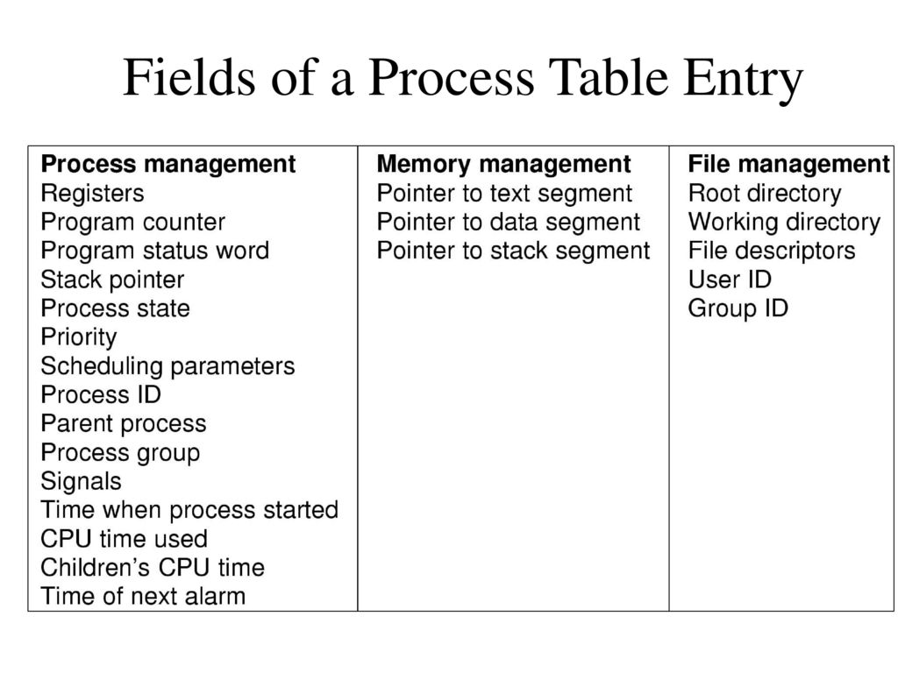
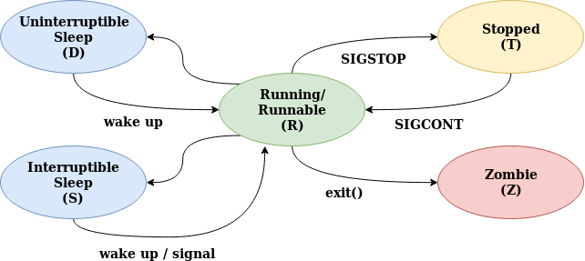

# Процессы

Процесс -- экземпляр исполнения программы.

В ядре операционной системы хранится таблица процессов. Наиболее существенные аттрибуты

* Для восстановления состояния процесса при переключении, нам нужно сохранить:
    * `pc` указатель на следующую инструкцию
    * `sp` указатель на стек
    * сами регистры можно просто сохранять на стек при преключении или хранить отдельно
    * состояние процесса (их диаграмма будет ниже)
* Для контроля за процессами нужно помнить:
    * `pid` идентификатор процесса
    * `pid` родителя, чтобы оповещать его об изменении статусов ребёнка
    * `uid` и `gid` для квотирования ресурсов
* Планировщику нужно знать
    * приоритет
    * время исполнения
* Для работы с файлами нужно хранить:
    * таблицу фаловых дескрипторов
    * текущую директорию, от которой считаются относительные пути (напомню, что это причина, по которой нет утилиты `cd`)
    * корневую директорию, от которой считаются абсолютные пути. Это, в частности, позволяет изолировать процессы друг от друга.

Процесс может находится в разных состояниях:
* Выполняется
* Остановлен (до получения сигнала `SIGCONT`, о них поговорим позже)
* Сон (например, ждёт ввода)
* Зомби (процесс завершился, но ещё не удалён из таблицы процессов)

## Создание процессов. fork

Системный вызов `fork` создаёт почти полную копию текущего процесса за исключением:

* `pid`
* маски сигналов, ожидающих обработки
* блокировок памяти и файлов
* таймеров
* операция неблокирующего чтения

`pid_t fork(void)`

В родителе при успешном он возвращает `pid` ребёнка, а в самом ребёнке `0`. Чтобы получить `pid` в самом ребёнке можно, например, использовать системный вызов `getpid`.

Но раз вы создали некоторый ресурс, нужно не забыть его удалить (иначе в таблице процессов кончится место). Для этого служит семейство семейных вызовов `wait`. Наиболее часто для этого используют `waitpid`.

`pid_t waitpid(pid_t pid, int *wstatus, int options);`

Он позволяет дождаться процесса по `pid` и получить его статус возврата. С помощью `WEXITSTATUS(wstatus)` можно вытащить из него код возврата. По-умолчанию `waitpid` ждёт перехода в зомби, но можно с помощью опцию переопределить это поведение на какие-то другие состояния процесса.

Пример использования этих конструкций можно найти в `fork_hello.c`.

С помощью флага `MAP_SHARED` можно передать от ребёнка какую-то информацию родителю, пример можно увидеть в `mmap_shared.c`.