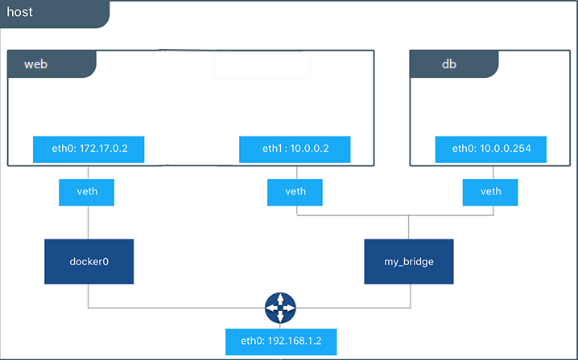

# Контейнеры

Контейнер это набор изолированных процессов. Изоляция происходит на уровне файловой системы, сети, процессов и других ресурсов.


В отличии от виртуальных машин, в которых поверх гипервизора запускается гостевая система целиком, включая ядро, контейнеры используют ядро хостовой ОС. Это требует меньше ресурсов, но взамен мы жертвуем возможностью эмулировать другие ОС (например Linux на Mac) и безопасностью.

## namespaces

Namespaces это компонент ядра Linux, который позволяет изолировать ресурсы. Категории ресурсов можно посмотреть в ``/proc/pid/ns``. Отделение части ресурсов процесса в новую группу происходит с помощью системного вызова ``unshare``.

### pid


Внутри контейнера видны только его процессы.

```
$  docker run -it --rm busybox
/ # ps aux
PID   USER     TIME  COMMAND
    1 root      0:00 sh
    7 root      0:00 ps aux
```

### mount


```
/ # mount
overlay on / type overlay (rw,relatime,lowerdir=/var/lib/docker/overlay2/l/FT5QA66BOLCNWLHESUCX7GXQAF:/var/lib/docker/overlay2/l/QGKLLJVDLJEAQEPKFI5TNULEA7,upperdir=/var/lib/docker/overlay2/fd9a065e6c797fda3f02a9a7abca98cbce567d93698cb5d2fdd977c5f7c88b57/diff,workdir=/var/lib/docker/overlay2/fd9a065e6c797fda3f02a9a7abca98cbce567d93698cb5d2fdd977c5f7c88b57/work,nouserxattr)
...
```

Видно, что в корень контейнера смонтирована некая ``overlayfs``. Этот вид ФС использует ``Copy-on-write`` идиому. ``lower_dir`` это ``readonly`` слои ``image`` (команда ``RUN`` порождает новый слой, поэтому, по возможности, объединяйте команды в цепочки), которые можно переиспользовать для разных контейнеров. Когда вы меняете файл внутри контейнера, он записывается в ``upper_dir`` (в частности, если удалить файл из нижнего слоя, в верхнем появится файл-заглушка). ``Overlayfs`` на лету склеивает из слоев ``merged_dir``, именно ее вы и видите внутри контейнера.

Подробнее можно почитать в официальной документации: https://docs.docker.com/storage/storagedriver/overlayfs-driver/

### network



По-умолчанию ``docker`` создает виртуальный свитч ``docker0``, который объединяет контейнеры и хост между собой.

```
$ ip addr
...
5: docker0: <BROADCAST,MULTICAST,UP,LOWER_UP> mtu 1500 qdisc noqueue state UP group default 
    link/ether 02:42:90:66:2a:b9 brd ff:ff:ff:ff:ff:ff
    inet 172.17.0.1/16 brd 172.17.255.255 scope global docker0
       valid_lft forever preferred_lft forever
...
``` 

Можно проверить, что контейнеры пингуются друг из друга. 

Можно создавать отдельные свитчи для групп контейнеров: ``docker network create network_name``. Можно видеть, что в этом случае контейнеры не видят друг-друга. 

На самом деле, есть другие варианты настройки сети в контейнерах. Неплохой гайд с картинками: https://k21academy.com/docker-kubernetes/docker-networking-different-types-of-networking-overview-for-beginners/


## cgroups


Cgroups задают ограничения на ресурсы. Их иерархию можно посмотреть с помощью ``systemd-cgls``. Далее через ``sysfs`` можно смотреть информацию конкретной группе. Например: 

```
$ cat /sys/fs/cgroup/system.slice/containerd.service/pids.current 
36
```

## Toy containers

Пример минимальной реализации контейнеризации с помощью вышеописанных механизмов можно посмотреть по ссылке: https://github.com/carzil/containers/tree/master
