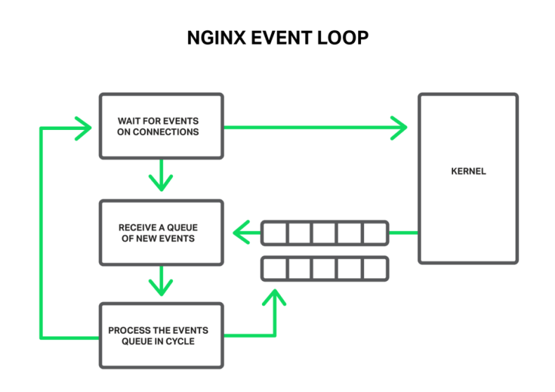

# epoll

На прошлом семинаре мы научились писать TCP-сервер. Проблема была в том, что он обслуживал только одного клиента за раз. Мы решили это тем, что создавали по процессу на каждого клиента. Но это было очень ресурсозатратно. В популярном веб-сервере Apache в какой-то момент решили заранее создавать фиксированной количество процессов под обработку соединений (prefork model). Далее процессы заменили на потоки и сэкономили ещё какое-то количество ресурсов.

Большую часть времени процесс всё ещё находится в ожидании ответа от клиента. А мог бы заниматься какой-то полезной работой. Мы хотим научиться обрабатывать несколько сокетов одним потоком. Именно эту задачу решали разработчики NGINX (подробнее можно почитать про это здесь: https://www.aosabook.org/en/nginx.html).

## Неблокирующий ввод/вывод

В обычном режиме системные вызовы `read/write` блокируются, пока данные не считаются/запишутся. Если вы пытаетесь одновременно обработать несколько сокетов, это может стать узким местом. Можно установить файловому дескриптору специальный неблокирующий режим. Тогда, при попытке из него считать вернётся `-1` и ошибка `EAGAIN` в случае отсутсвия данных. 

```
int current_descriptor_flags = fcntl(fd, F_GETFL);
fcntl(fd, F_SETFL, current_descriptor_flags | O_NONBLOCK);
```

Тогда можно вернуться к обработке этого файлового дескриптора позже, а пока обработать другие.

Этот механизм не работает, к сожалению, для диска. А это могло бы быть полезно при считывании больших файлов. Для этого недавно в Linux появился новый механизм [IO_URING](https://habr.com/ru/post/589389/).

## Поллинг

Как понять, что в файловом дескрипторе появились данные, которые можно прочитать? Для этого в ядре Linux (обратите внимание, в отличии от большинства конструкций курса, эта не работает на MAC, там есть `kqueue`) есть возможность создать специальную очередь событий.

Сначала её нужно создать:

```
int epoll_create(int size);
// size = max number of events
// returns fd
```

События в очереди описываются специальной структурой:

```
#include <sys/epoll.h>

typedef union {
    void*       ptr;
    int         fd;
    uint32_t    u32;
    uint64_t    u64;
} epoll_data_t;

struct epoll_event {
    uint32_t        events; // маска событий (EPOLLIN | EPOLLOUT | EPOLLHUP | EPOLLERR)
    epoll_data_t    data;   // произвольное поле, заполненное при регистрации
};
```

Чтобы начать следить за файловым дескриптором, нужно настроить интересные типы событий.

```
epoll_ctl(
    int epoll_fd,
    int op, // (EPOLL_CTL_ADD | EPOLL_CTL_MOD | EPOLL_CTL_DEL)
    int fd, // interesting fd
    struct epoll_event *event
);
```

После этого в цикле можно считывать события из очереди и обрабатывать:

```
struct epoll_event events[MaxEventsToRead];
int N = epoll_wait(
                   int epoll_fd,
                   struct epoll_event *events, // array to store events
                   int MaxEventsToRead, // max event count
                   int timeout // timeout or -1
                  );
// returns number of events
```

Пример Echo-сервера на epoll можно найти в `server_epoll.c`.

## NGINX

Более современный веб-сервер NGINX использует epoll в worker процессах, которые обрабатывают клиентов. Это позволяет ему тратить в 100 раз меньше памяти на клиентов чем Apache и легко выдерживать 10K соединений.



Далее авторы придумали ещё одну оптимизацию. Завести фиксированный пул потоков для обработки операций ввода-вывода. Задачи складываются в очередь, которую потом разбирают потоки. За счёт этого конкретный медленный клиент не тормозит всех остальных. Подробнее можно почитать в блоге: https://www.nginx.com/blog/thread-pools-boost-performance-9x/


## Outro

В жизни `epoll` напрямую вы использовать, скорее всего, не будете. Однако, именно он работает под капотом популярных библиотек. Для примера можно посмотреть на echo-сервер на [Asio](https://github.com/chriskohlhoff/asio/blob/master/asio/src/examples/cpp14/echo/async_tcp_echo_server.cpp).

Хорошие конспект с картинками, чтобы закрепить знания: https://copyconstruct.medium.com/the-method-to-epolls-madness-d9d2d6378642.