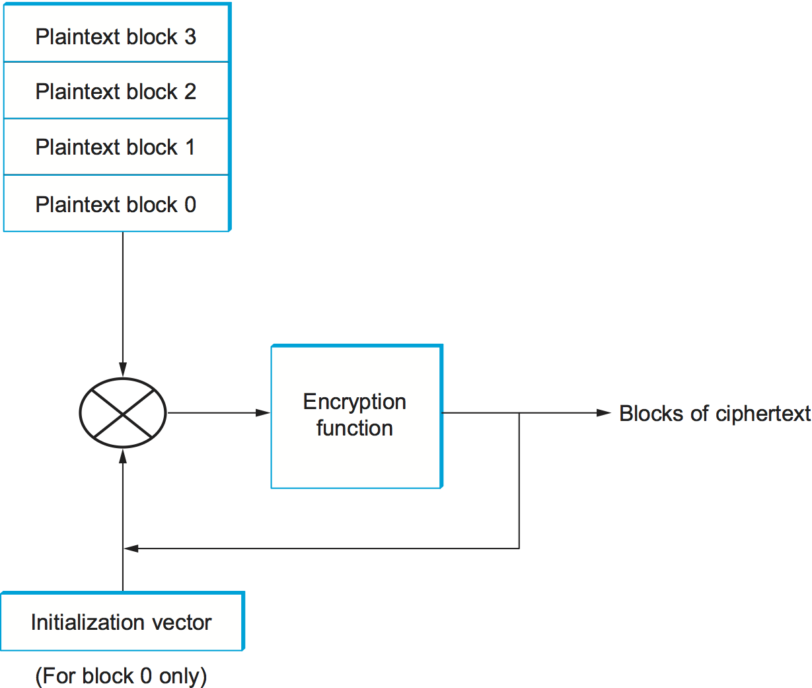

# Безопасность

## Задачи которые мы решаем

* Конфидециальность -- прочесть сообщение могут только получатель и отправитель
* Ауентификация -- получатель и отправитель могут подтвердить источник сообщения
* Целостность -- получать и отправитель могут понять, что сообщение не было изменено в процессе передачи

## Принципы шифрования

Отправитель применяет некоторую функцию (шифр) к исходному тексту, обратить которую может только получатель. Поскольку придумывать каждый раз новые эффективные алгоритмы шифрования тяжело, ещё в 19 веке криптографы решили, что результат шифра должен зависеть не только от входа, но и от ключа. Таким образом алгоритмы публично известны и проверены годами, а для конкретного взаимодействия нужно менять только ключ. 

Большинство современных шифров -- блочный. Они используют ключ небольшого размера (как правило, сотни бит) и шифрует с его помощью блоки соответствующего размера. У такого подхода есть минус, что одинаковые блоки исходного текста переходят в одинаковые после шифрования. Чтобы такого не было, при шифровании учитывается контекст, высчитанный на основе предыдущих блоков. Изначально он равен Initialization Vector.

## Симметричное шифрование

Симметричное шифрование называется так, потому что для шифрования и расшифровки используется один и тот же ключ. В домашнем задании вы будете использовать популярный алгоритм AES. Подробнее про него можно почитать тут: https://habr.com/ru/post/112733/. 

Проблема симметричного шифрования в том, что вам нужно как-то заранее обменяться ключом. Обычно для этого используют ассиметричное шифрование.

## Ассиметричное шифрование

В ассиметричном шифровании есть два ключа: публичный для шифрования и приватный для расшифровки. Наиболее популярный алгоритм RSA использует факторизацию больших чисел. Почитать подробнее: https://neerc.ifmo.ru/wiki/index.php?title=RSA

Поскольку он вычислительно значительно более сложный, применяется обычно для обмена ключами.

А можно наоборот зашифровать сообщение приватным ключом, а расшифровывать публичным. С точки зрения обмена секретами сообщения, которые может расшифровать кто угодно, не очень полезны. Зато именно так работает электронная подпись.

Проблема целостности решается тем, что вместе с сообщением передаётся хэш-функция (например семейства SHA-2) от конкатенация исходного текста с секретом.

## Сертификаты

Проблема, которая сразу всплывает, как понять, что публичный ключ действительно принадлежит нужному агенту. Например, если вы передаёте сайту банка данные банковской карты, вы хотите убедиться, что это действительно он.

Один из вариантов решения -- подписывать публичный ключ сертификатом. Сертификат подписан сертификатом более высокого уровня и так далее. Так называемые корневые сертификаты вшиваются, например, в браузеры.

## TLS

Транспортный уровень решает проблему доставки сообщений от отправителя для адресата. На следующем уровне мы хотим решить проблему безопасной доставки, потому что если при перехвате вскроются данные вашей кредитной карты, будет неприятно.

Механизм установки соединения напоминает TCP.

Сначала клиент и сервер договаривается об алгоритмах, которые дальше будут использовать, например AES с SHA-256. После этого сервер может послать свой публичный ключ ключ клиенту. Далее на основе него и времён отправки генерируются секреты (по-одному на каждое направление связи).

## IPSec

IPSec это семейство протоколов для безопасной передачи данных по сети.

Первая часть Authentication Header и Encapsulating Security Payload для передачи данных по установленному соединению.

Вторая часть ISAKMP для обмена ключами и установки соединения.

ESP это протокол для безопасной передачи данных через SA. Заголовок ESP находится после IP заголовка. В тунельном режиме оригинальный IP пакет упаковывается в ESP целиком и шифруется. 

Ровно так построен VPN. Подробнее можно почитать в СДСМ: https://linkmeup.ru/blog/1197/