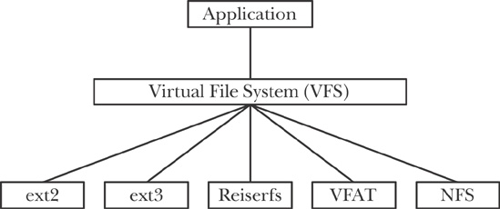

# FUSE

## VFS

Операционная система предоставляет разработчику множество удобных абстракций. Примерами таких абстракций являются файлы и процессы. Под ними, зачастую, есть более низкоуровневые абстракции. Одной из них является файловая система.

Что мы ожидаем от файловой системы? Хранение файлов и их атрибутов в некоторой древовидной структуре. То есть нужно, чтобы были реализованы системные вызовы `open`, `stat`, `read` и другие. VFS (virtual file system) -- интерфейс, реализацией которого являются конкретные файловые системы, такие как `ext4` или `tmpfs`.



Файловая система монтируется по какому-то пути от корня (`/`). Вывести текущие примонтированные файловые системы можно с помощью `mount`.
```
(base) arslan@arslan-zenbook:~$ mount
sysfs on /sys type sysfs (rw,nosuid,nodev,noexec,relatime)
proc on /proc type proc (rw,nosuid,nodev,noexec,relatime)
udev on /dev type devtmpfs (rw,nosuid,noexec,relatime,size=3966908k,nr_inodes=991727,mode=755)
devpts on /dev/pts type devpts (rw,nosuid,noexec,relatime,gid=5,mode=620,ptmxmode=000)
tmpfs on /run type tmpfs (rw,nosuid,nodev,noexec,relatime,size=803152k,mode=755)
/dev/sda9 on / type ext4 (rw,relatime,errors=remount-ro)
```

Основные структуры VFS:

* `file_system_type` содержит метаинформацию о физическом устройстве, суперблоках, владельце и так далее. Также имеет метод `mount`, который возвращает `dentry`, соответствующий корневой директории файловой системы
* `super_operations` интерфейсы для операции над суперблоком. Суперблок хранит основную часть метаданных файловой системы, количество `inode`, ссылки на них и так далее. Интерфейс позволяет создавать `inode`, что-то в них записывать и проводить другие манипуляции.
* `inode_operations` отвечают за взаимодействия с конкретной `inode`: создание, добавление ссылок и так далее.
* `file_operations` отвечает за взаимодействие на уровне файлов: уже привычные вам вызовы `open`, `write` и прочие

Это не исчерпывающее описание интерфейсов, подробнее можно почитать в официальной документации: https://docs.kernel.org/next/filesystems/vfs.html

## OverlayFS

Зачастую на базе одного образа на машине работают несколько контейнеров. Копировать файлы образа в них все было бы расточительно. Нужен инструмент, который позволит контейнерам иметь общую часть файловый системы, но при этом всё ещё иметь изоляцию между ними.

Такой инструмент называется OverlayFS, и он встроен в современные версии ядра Linux. Идея состоит в том, что есть нижний слой, доступный только для чтения (их может быть несколько, тогда выбирается файл из самой левой директории, в которой он есть), и верхний модифицируемый. То есть мы применяем идиому `Copy-on-write` для файловых систем.


Небольшой пример для демонстрации:

```
mkdir lower upper workdir overlay
sudo mount -t overlay -o lowerdir=lower,upperdir=upper,workdir=workdir none overlay
echo "from lower" >> lower/file1.txt
echo "from upper" >> upper/file2.txt
```

Посмотрим на содержимое директорий. Видно, что в `overlay` директории хранятся просто жёсткие ссылки на те же `inode`.

```
(base) arslan@arslan-zenbook:~/teaching/caos-seminars/sem25-fuse$ ls -li overlay
total 8
976290 -rw-rw-r-- 1 arslan arslan 11 апр 12 00:54 file1.txt
976295 -rw-rw-r-- 1 arslan arslan 11 апр 12 00:55 file2.txt
(base) arslan@arslan-zenbook:~/teaching/caos-seminars/sem25-fuse$ ls -li lower
total 4
976290 -rw-rw-r-- 1 arslan arslan 11 апр 12 00:54 file1.txt
(base) arslan@arslan-zenbook:~/teaching/caos-seminars/sem25-fuse$ ls -li upper
total 4
976295 -rw-rw-r-- 1 arslan arslan 11 апр 12 00:55 file2.txt
```

Что будет, если изменить файл из нижнего слоя? Создастся копия в верхнем, и в ней будут произведены изменения, что довольно ожидаемо.
```
(base) arslan@arslan-zenbook:~/teaching/caos-seminars/sem25-fuse$ echo ' modified' >> overlay/file1.txt 
(base) arslan@arslan-zenbook:~/teaching/caos-seminars/sem25-fuse$ ls -li overlay
total 8
976290 -rw-rw-r-- 1 arslan arslan 21 апр 12 00:59 file1.txt
976295 -rw-rw-r-- 1 arslan arslan 11 апр 12 00:55 file2.txt
(base) arslan@arslan-zenbook:~/teaching/caos-seminars/sem25-fuse$ ls -li upper
total 8
976343 -rw-rw-r-- 1 arslan arslan 21 апр 12 00:59 file1.txt
976295 -rw-rw-r-- 1 arslan arslan 11 апр 12 00:55 file2.txt
(base) arslan@arslan-zenbook:~/teaching/caos-seminars/sem25-fuse$ ls -li lower
total 4
976290 -rw-rw-r-- 1 arslan arslan 11 апр 12 00:54 file1.txt
```

Подробнее можно почитать в документации ядра: https://docs.kernel.org/filesystems/overlayfs.html

Посмотрим на то, как это применяется в контейнерах.

Запустим `busybox`.

```
(base) arslan@arslan-zenbook:~$ docker run -it --rm busybox
/ # echo 'hello' > kek.txt
```

Получим информацию о файловой системе запущенного контейнера.

```
(base) arslan@arslan-zenbook:~$ docker ps
CONTAINER ID   IMAGE       COMMAND                  CREATED          STATUS          PORTS                 NAMES
c147a628f94e   busybox     "sh"                     13 seconds ago   Up 12 seconds                         musing_fermi
(base) arslan@arslan-zenbook:~$ docker inspect c147a628f94e -f '{{.GraphDriver.Data}}'
map[LowerDir:/var/lib/docker/overlay2/cd27c4ba79063f37c8212cc2aa574f18935aa887323c4f8040d0ec6cdc5455db-init/diff:/var/lib/docker/overlay2/fefb58afbcad3de7933cf7e1d9d6c7f59b53aa063d515745d281c28769c456c4/diff MergedDir:/var/lib/docker/overlay2/cd27c4ba79063f37c8212cc2aa574f18935aa887323c4f8040d0ec6cdc5455db/merged UpperDir:/var/lib/docker/overlay2/cd27c4ba79063f37c8212cc2aa574f18935aa887323c4f8040d0ec6cdc5455db/diff WorkDir:/var/lib/docker/overlay2/cd27c4ba79063f37c8212cc2aa574f18935aa887323c4f8040d0ec6cdc5455db/work]
```

Можно убедиться, что итоговая файловая система действительно раскладывается на вышеперечисленные слои.

```
(base) arslan@arslan-zenbook:~$ sudo ls /var/lib/docker/overlay2/fefb58afbcad3de7933cf7e1d9d6c7f59b53aa063d515745d281c28769c456c4/diff
bin  dev  etc  home  lib  lib64  root  tmp  usr  var
(base) arslan@arslan-zenbook:~$ sudo ls /var/lib/docker/overlay2/cd27c4ba79063f37c8212cc2aa574f18935aa887323c4f8040d0ec6cdc5455db-init/diff
dev  etc  proc  sys
(base) arslan@arslan-zenbook:~$ sudo ls /var/lib/docker/overlay2/cd27c4ba79063f37c8212cc2aa574f18935aa887323c4f8040d0ec6cdc5455db/diff
kek.txt  root
(base) arslan@arslan-zenbook:~$ sudo ls /var/lib/docker/overlay2/cd27c4ba79063f37c8212cc2aa574f18935aa887323c4f8040d0ec6cdc5455db/merged
bin  dev  etc  home  kek.txt  lib  lib64  proc  root  sys  tmp  usr  var
```

Обратите внимание, что каждая команда `RUN` порождает новый слой (см. пример из `docker`), поэтому стоит вызывать сразу несколько команд.

```
(base) arslan@arslan-zenbook:~/teaching/caos-seminars$ docker inspect e09417bd9904 -f '{{.GraphDriver.Data}}'
map[LowerDir:/var/lib/docker/overlay2/86cc85517b9cb6840e35c4f63f1c4af19250b577a09506177d34a77bf1313375-init/diff:/var/lib/docker/overlay2/3e978de64e3dadc70a03fe1277fd3722c72b3effc0380740bc69dd2f1fa0e8cc/diff:/var/lib/docker/overlay2/fcd90dad3ac10016209bd2109adf999df0a869199db01ca38ddb4c0f0dc43d4b/diff:/var/lib/docker/overlay2/fefb58afbcad3de7933cf7e1d9d6c7f59b53aa063d515745d281c28769c456c4/diff MergedDir:/var/lib/docker/overlay2/86cc85517b9cb6840e35c4f63f1c4af19250b577a09506177d34a77bf1313375/merged UpperDir:/var/lib/docker/overlay2/86cc85517b9cb6840e35c4f63f1c4af19250b577a09506177d34a77bf1313375/diff WorkDir:/var/lib/docker/overlay2/86cc85517b9cb6840e35c4f63f1c4af19250b577a09506177d34a77bf1313375/work]
(base) arslan@arslan-zenbook:~/teaching/caos-seminars$ sudo ls /var/lib/docker/overlay2/3e978de64e3dadc70a03fe1277fd3722c72b3effc0380740bc69dd2f1fa0e8cc/diff
lol.txt
(base) arslan@arslan-zenbook:~/teaching/caos-seminars$ sudo ls /var/lib/docker/overlay2/fcd90dad3ac10016209bd2109adf999df0a869199db01ca38ddb4c0f0dc43d4b/diff
kek.txt
(base) arslan@arslan-zenbook:~/teaching/caos-seminars$ sudo ls /var/lib/docker/overlay2/86cc85517b9cb6840e35c4f63f1c4af19250b577a09506177d34a77bf1313375-init/diffdev  etc  proc1csys19250b577a0950617
```

Подробнее можно почитать в официальной документации: https://docs.docker.com/storage/storagedriver/overlayfs-driver/

## FUSE

Напрямую реализовывать интерфейсы из VFS довольно трудоёмко. Тут на помощь приходит библиотека FUSE, которая позволяет проксировать системные вызовы вашей программе, работающей в userspace.


Реализации нужно прописать в структуру `fuse_operations`. Для задач хватит нескольких основных вызовов, полный список можно найти в документации: https://libfuse.github.io/doxygen/structfuse__operations.html

Для отладки рекомендуется вызывать под `strace` стандартные команды такие как `stat`, `ls` и другие.

TODO: Разобраться со сборкой
